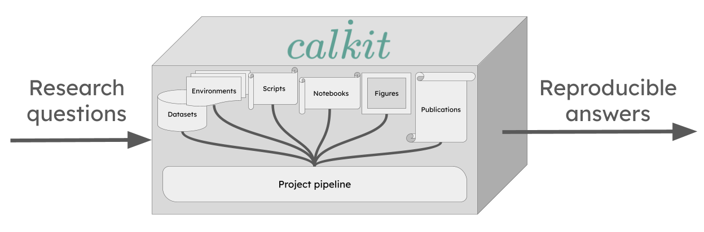

<p align="center">
  <a href="https://calkit.org" target="_blank">
    
  </a>
</p>
<p align="center">
  <a href="https://docs.calkit.org" target="_blank">
    Documentation
  </a>
  |
  <a href="https://docs.calkit.org/tutorials" target="_blank">
    Tutorials
  </a>
  |
  <a href="https://github.com/orgs/calkit/discussions" target="_blank">
    Discussions
  </a>
</p>

<!-- INCLUDE: docs/index.md -->

Typical research workflows are horizontally-siloed, i.e.,
various stages--data collection, analysis, writing--are performed in
disconnected systems,
turning research into a slow, error-prone, and tedious
[waterfall](https://en.wikipedia.org/wiki/Waterfall_model) process.

Calkit helps you integrate code, data, figures, results, publications,
and more into a cohesive, traceable, and portable _knowledge creation system_,
so every output can be traced back to its source (provenance)
and reproduced with a single command.

With industry standard tools combined into a unified and simplified experience
tailored for research,
you can reap the rewards of reproducibility and automation
without the cognitive overhead.

<!-- https://docs.google.com/drawings/d/1XMGnbgYYNFAVUBDyUaCyLfRB7efvJdrnrKmFlNmT19o/edit -->



## Features

- A simplified [version control](https://docs.calkit.org/version-control)
  interface that unifies Git and DVC (Data Version Control),
  so everything can be kept in the same project repository.
  This way, code doesn't need to be siloed away from other
  important artifacts like datasets, models, figures, or article PDFs,
  allowing you to work on all parts of a project without hopping around to
  different tools.
- [Computational environment management](https://docs.calkit.org/environments) with support for many
  languages and environment managers: Conda, Docker, uv, Julia, Renv, and more.
  No need to create and update environments on your own. Calkit will handle
  them as needed.
- An environment-aware build system or [pipeline](https://docs.calkit.org/pipeline) with
  a simple declarative syntax and
  output caching so you don't need to think about which steps or stages
  need to be rerun after changing any part of the project.
  Simply call `calkit run`.
  Compose your pipeline from many different kinds of stages,
  including simple scripts, commands, Jupyter Notebooks, LaTeX, and more.
- A complementary self-hostable and GitHub-integrated
  [cloud platform](https://github.com/calkit/calkit-cloud)
  to facilitate backup, collaboration,
  and sharing throughout the entire research lifecycle.
- [Overleaf integration](https://docs.calkit.org/overleaf/), so
  analysis, visualization, and writing can all stay in sync
  (no more manual uploads!)
- Support for running on [high performance computing (HPC)](https://docs.calkit.org/hpc) systems
  that use PBS or SLURM schedulers.
- Support for automated running with
  [GitHub Actions](https://docs.calkit.org/tutorials/github-actions).
- Extensions for doing all of the above graphically in
  [JupyterLab](https://docs.calkit.org/jupyterlab) and
  [VS Code](https://marketplace.visualstudio.com/items?itemName=Calkit.calkit-vscode).

<!-- END INCLUDE -->

## Installation

<!-- INCLUDE: docs/installation.md +1 -->

On Linux, macOS, or Windows Git Bash,
install Calkit and [uv](https://docs.astral.sh/uv/)
(if not already installed) with:

```sh
curl -LsSf install.calkit.org | sh
```

Or with Windows Command Prompt or PowerShell:

```powershell
powershell -ExecutionPolicy ByPass -c "irm install-ps1.calkit.org | iex"
```

If you already have uv installed, install Calkit with:

```sh
uv tool install calkit-python
```

You can also install with your system Python:

```sh
pip install calkit-python
```

To effectively use Calkit, you'll want to ensure [Git](https://git-scm.com)
is installed and properly configured.
You may also want to install [Docker](https://docker.com),
since that is the default method by which LaTeX environments are created.
If you want to use the [Calkit Cloud](https://calkit.io)
for collaboration and backup as a DVC remote,
you can [set up cloud integration](https://docs.calkit.org/cloud-integration) with:

```sh
calkit cloud login
```

If you use AI agents like Claude, Copilot, or Codex,
see [AI tools](https://docs.calkit.org/ai-tools)
to learn how to install agent skills for working with Calkit.

### Use without installing

If you want to use Calkit without installing it,
you can use uv's `uvx` command to run it directly:

```sh
uvx calk9 --help
```

### Nix

Calkit ships a [flake](https://nixos.wiki/wiki/Flakes) at the root of
its repo, so [Nix](https://nixos.org/) users can pull the CLI into their
environments alongside their other tools.

Run it ad hoc without installing:

```sh
nix run github:calkit/calkit -- --help
```

Drop into a shell that has `calkit`, `git`, and `uv` on `PATH`:

```sh
nix shell github:calkit/calkit
```

Add it to your own `flake.nix` as an input:

```nix
{
  inputs.calkit.url = "github:calkit/calkit";
  inputs.nixpkgs.url = "github:NixOS/nixpkgs/nixos-unstable";

  outputs = { self, nixpkgs, calkit }: {
    devShells.x86_64-linux.default =
      nixpkgs.legacyPackages.x86_64-linux.mkShell {
        packages = [ calkit.packages.x86_64-linux.default ];
      };
  };
}
```

Then `nix develop` will give you a shell with the Calkit CLI ready to
use. To pin a specific Calkit release inside the shell, set the
`CALKIT_VERSION` environment variable (e.g. `CALKIT_VERSION=0.41.0`)
before invoking `calkit`.

The flake is currently a thin wrapper around `uvx --from calkit-python
calkit`. It depends on `uv` from `nixpkgs` and fetches the published
wheel from PyPI on first use. This trades a fully Nix-native build for
zero version-drift maintenance, and avoids the macOS `docx2pdf` /
`appscript` and JupyterLab labextension build issues that block a pure
nixpkgs derivation today. If you want a fully nixpkgs-native build,
see the community [`calkit-nix`](https://github.com/dwinkler1/calkit-nix)
flake.

Nix isn't supported natively on Windows; run Calkit inside
[WSL2](https://learn.microsoft.com/en-us/windows/wsl/install) and use
the flake there.

### Running against a specific version

If a project requires a Calkit version other than the one you have
installed, use the top-level `--use-version` flag to re-invoke the CLI
under that release without changing your installation:

```sh
calkit --use-version 0.38 run
```

This re-execs the CLI via `uvx --from calkit-python@<version> calkit`,
so it requires [uv](https://docs.astral.sh/uv/) on `PATH`.
You can also declare a minimum version in `calkit.yaml`;
see
[Pinning the Calkit CLI version](https://docs.calkit.org/dependencies.md#pinning-the-calkit-cli-version).

### Calkit Assistant

For Windows users, the
[Calkit Assistant](https://github.com/calkit/calkit-assistant)
app is the easiest way to get everything set up and ready to work in
VS Code, which can then be used as the primary app for working on
all scientific or analytical computing projects.


<!-- END INCLUDE -->

## Quickstart

<!-- INCLUDE: docs/quickstart.md +1 -->

<!-- prettier-ignore -->
!!! note
    `ck` is an abbreviated alias for the `calkit` executable.
    All `calkit` commands can be run as `ck` instead, e.g., `ck save -am "..."`.

### From an existing project

If you want to use Calkit with an existing project,
navigate into its working directory and use the `xr` command to start
executing and recording your scripts, notebooks, LaTeX files, etc.,
as reproducible pipeline stages.
For example:

```sh
calkit xr scripts/analyze.py

calkit xr notebooks/plot.ipynb

calkit xr paper/main.tex
```

Calkit will attempt to detect environments, inputs, and outputs and
save them in `calkit.yaml`.
If successful,
you'll be able to run the full pipeline with:

```sh
calkit run
```

Next, make a change to e.g., a script and look at the output of
`calkit status`.
You'll see that the pipeline has a stage that is out-of-date:

```sh
---------------------------- Pipeline ----------------------------
analyze:
        changed deps:
                modified:           scripts/analyze.py
```

This can be fixed with another call to `calkit run`.

You can save (add and commit) all changes with:

```sh
calkit save -am "Add to pipeline"
```

### Fresh from a Calkit project template

Create a new project from the
[`calkit/example-basic`](https://github.com/calkit/example-basic)
template with:

```sh
calkit new project my-research \
    --title "My research" \
    --template calkit/example-basic \
    --cloud
```

Note the `--cloud` flag requires [cloud integration](https://docs.calkit.org/cloud-integration)
to be set up, but can be omitted if the project doesn't need to be backed up to
the cloud or shared with collaborators.
Cloud integration can also be set up later.

Next, move into the project folder and run the pipeline,
which consists of several stages defined in `calkit.yaml`:

<!-- TODO: This takes a long time to pull the image -->

```sh
cd my-research
calkit run
```

Next, make some edits to a script or LaTeX file and run `calkit status` to
see what stages are out-of-date.
For example:

```sh
---------------------------- Pipeline ----------------------------
build-paper:
        changed deps:
                modified:           paper/paper.tex
```

Execute `calkit run` again to bring everything up-to-date.

To back up or save the project, call:

```sh
calkit save -am "Run pipeline"
```

### With an AI coding agent

Simply tell the [AI agent](https://docs.calkit.org/ai-tools):

> Turn this folder into a Calkit project

or

> Create me a new Calkit project for investigating...

<!-- END INCLUDE -->

## Get involved

We welcome all kinds of contributions!
See [CONTRIBUTING.md](CONTRIBUTING.md) to learn how to get involved.

## Acknowledgements

<!-- INCLUDE: docs/acknowledgements.md +1 -->

Calkit is supported by the
[Caltech Schmidt Academy of Software Engineering](https://sase.caltech.edu).

<p align="center">
  <a href="https://sase.caltech.edu" target="_blank">
    
  </a>
<a href="https://schmidtsciences.org/" target="_blank">
    
  </a>
</p>

<!-- END INCLUDE -->
