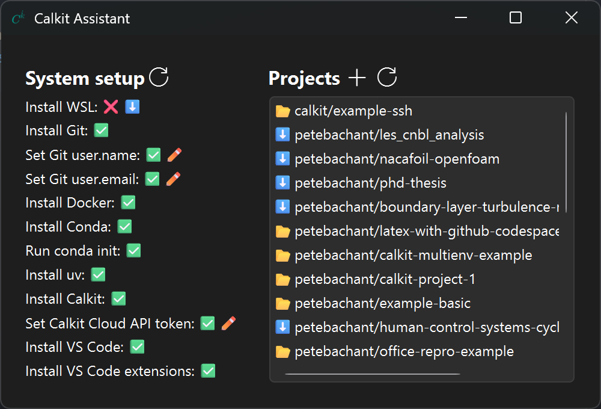

# Calkit Assistant

A desktop app to help set up and manage
a modern, open-source scientific computing environment.

## Getting started

Simply download and run the executable from the latest
[⬇️ assistant release](https://github.com/calkit/calkit/releases?q=assistant%2Fv&expanded=true).
