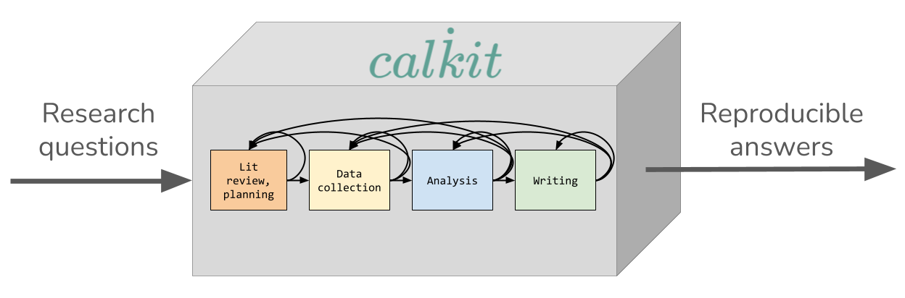

# Home

Calkit makes it easy to create
["single button"](https://doi.org/10.1190/1.1822162)
reproducible research projects.
Instead of a loosely related collection of files
split across multiple systems or apps,
"integrated" via manual steps,
your project becomes a version-controlled, self-contained "calculation kit"
tying together data collection, analysis, visualization, and writing,
so you, your collaborators, and your readers can go from raw data to
research article with a single command.
That means faster iteration, fewer mistakes,
and no more wondering how a figure was made six months after submitting
the paper.

<!-- https://docs.google.com/drawings/d/1XMGnbgYYNFAVUBDyUaCyLfRB7efvJdrnrKmFlNmT19o/edit -->

## Why Calkit?

Research is iterative.
The first version of an analysis is rarely the last:
a reviewer asks for another case, a bug turns up in preprocessing,
new data arrives, an advisor wants a different figure.
Each of those means going back to an earlier stage and rerunning
everything downstream.
If that takes a manual pass through scripts, exports, and uploads,
iterations get rationed, and the work stops improving when the effort
runs out rather than when it's right.
If it takes one command, and only what changed actually reruns,
iterating is nearly free,
and even modest cuts to a feedback loop
[measurably raise productivity](https://doi.org/10.1109/MS.2023.3275268).
That matters because iteration is what produces good work:
in controlled studies of design tasks, people who iterate more get
[better results](https://doi.org/10.1145/1640233.1640260),
and iterating even makes up for a lack of experience.
Automating a step takes about as long as doing it once by hand,
so it pays for itself the second time.
That's the case for single-button reproducibility:
not just that others can check the work, but that you can change it.

The parts of a research project are tightly coupled:
data feeds analysis, analysis makes figures, figures go in the paper,
and all of it exists to answer a question.
No piece is valuable on its own.
The whole kit is, and the paper is
[just the entrypoint](https://doi.org/10.1007/978-1-4612-2544-7_5).

Iteration requires integration:
keeping coupled things in separate places makes iteration slow.
Software teams figured this out and pulled development, testing, and
infrastructure into the same repo,
and teams that adopt continuous integration
[merge more contributions](https://doi.org/10.1145/2786805.2786850)
without a drop in quality.
Research projects tend to drift the other way:

- Datasets don't fit in Git, so they live on a shared drive.
- Expensive computations get run once and their outputs copied around by
  hand.
- Each script needs a different environment, and "works on my machine"
  creeps in
  ([74% of R files](https://doi.org/10.1038/s41597-022-01143-6) in a
  large sample of published replication packages fail to run).
- Figures are uploaded to Overleaf manually.
- Collaborators each have their own copy of the data and their own idea of
  which figure is current.

The tools to solve all of these already exist.
Git, uv, Make, and LaTeX will get a project to single-button
reproducible, and some people enjoy assembling that kind of setup.
But the tools don't come integrated with each other,
and they don't have easy entrypoints for someone who only wants to
contribute to one part, e.g., writing or review.
So when a collaborator needs to add a figure or edit the paper,
the project drifts back to emailed files and shared drives,
and the single button becomes many buttons with
[manual steps in between](https://doi.org/10.1371/journal.pcbi.1003285).
That turns research into a
[waterfall](https://en.wikipedia.org/wiki/Waterfall_model) process:
returning to an early stage like data collection or preprocessing is
[expensive](https://doi.org/10.1109/2.962984),
so it rarely happens, even when it should.

Calkit is a kit with the slots already there:
environments, datasets, notebooks, figures, publications,
and a pipeline connecting them, all described in `calkit.yaml`.
You put your pieces in.
It's also one thing to install:
when a project needs uv, pixi, Julia, Rust, or Nix and you don't have it,
`calkit run` offers to install it.
If you've built this kind of setup yourself, it should feel familiar,
and your collaborators get the same project through a browser,
VS Code, or JupyterLab without needing to.
`calkit run` builds environments and runs only what changed,
`calkit clone` pulls cached outputs so expensive stages don't rerun,
`calkit save` handles Git and DVC together,
and the paper is a pipeline stage like any other.

One description of the whole project also makes it checkable.
Every figure and number can be traced to the stage that produced it,
and a rerun shows whether that's true.
With AI agents doing more of the work, this matters:
an agent can make a plausible figure as easily as a real one.

Underneath, it's still Git, DVC, Docker, Conda, uv, and LaTeX,
and Calkit is a transparent layer over them rather than a replacement.
`git` and `uv` work on the project exactly as they would without it,
so you can go as deep into the tools as you like
while a collaborator who'd rather not works on the same project through
the easier path.
Nothing is hidden and nothing is locked in.

## Features

- A simplified [version control](version-control.md)
  interface that unifies Git and DVC (Data Version Control),
  so everything can be kept in the same project repository.
  This way, code doesn't need to be siloed away from other
  important artifacts like datasets, models, figures, or article PDFs,
  allowing you to work on all parts of a project without hopping around to
  different tools.
- [Computational environment management](environments.md) with support for many
  languages and environment managers: Conda, Docker, uv, Julia, Renv, and more.
  No need to create and update environments on your own. Calkit will handle
  them as needed.
- An environment-aware build system or [pipeline](pipeline/index.md) with
  a simple declarative syntax and
  output caching so you don't need to think about which steps or stages
  need to be rerun after changing any part of the project.
  Simply call `calkit run`.
  Compose your pipeline from many different kinds of stages,
  including simple scripts, commands, Jupyter Notebooks, LaTeX, and more.
- A complementary self-hostable and GitHub-integrated
  [hub](https://github.com/calkit/calkit/tree/main/hub)
  to facilitate backup, collaboration,
  and sharing throughout the entire research lifecycle.
- [Overleaf integration](https://docs.calkit.org/overleaf/), so
  analysis, visualization, and writing can all stay in sync
  (no more manual uploads!)
- Support for running on [high performance computing (HPC)](hpc.md) systems
  that use PBS or SLURM schedulers.
- Support for automated running with
  [GitHub Actions](tutorials/github-actions.md).
- Extensions for doing all of the above graphically in
  [JupyterLab](jupyterlab.md) and
  [VS Code](https://marketplace.visualstudio.com/items?itemName=Calkit.calkit-vscode).
- A [browser extension](browser-ext/index.md) for collecting references
  directly to BibTeX (optionally synced with Zotero),
  viewing DVC-stored files on GitHub,
  and syncing figures and results with Overleaf directly in Chrome,
  Microsoft Edge, and more.
