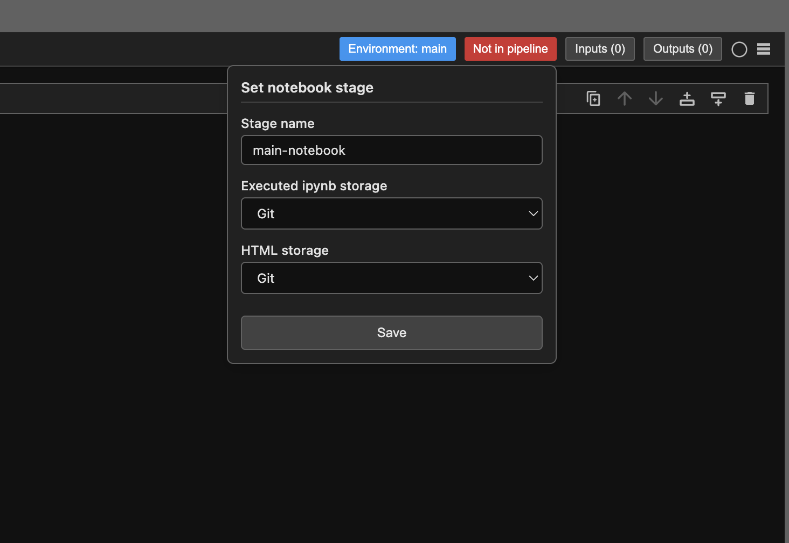

# Using Calkit with JupyterLab

Calkit includes a [JupyterLab](https://jupyter.org/)
extension for managing a project's environments and pipeline.
Installing Calkit will install JupyterLab itself as well,
so you can start it up with:

```sh
cd my-project-folder
calkit jupyter lab
```

With the extension, you won't need to remember to:

1. Fully document the environment for a notebook with
   `pip freeze` or `conda env export`.
1. Ensure the correct kernel is being used when a notebook is opened.
1. Ensure each notebook was run top-to-bottom any time its code or input
   files (e.g., datasets) have change.

Further, it will be obvious if any notebook outputs, e.g.,
figures, are out-of-date and require a rerun.

When you first open a new notebook, you'll see badges in the toolbar
showing that the notebook has no environment or pipeline stage defined.


Clicking on the environment badge will open a dialog
allowing you to select or create an environment for the notebook.
The environment editor will let you give the environment a name
and select which packages and versions to include.
There are "package group" shortcut buttons to quickly add common packages.
For example, the PyData package group includes NumPy, Pandas, Matplotlib,
SciPy, and more.


After assigning an environment to the notebook,
the kernel will be switched automatically,
and the badge will update to show the selected environment.
Note that if you move the project to a different machine or share it with
a collaborator, Calkit will recreate the environment automatically
based on the defined packages.

Next, click the pipeline badge to assign a pipeline stage to the notebook.
You'll see options for which type of storage (Git, DVC, or none)
to use to save the
executed and HTML versions of the notebook when it's run as part of the pipeline.



If the notebook reads any files, you'll want to add those as inputs
using the corresponding badge in the toolbar.
The same can be done for outputs, or files written by the notebook.
Defining these properly will allow Calkit to determine when a given
output is "stale" and needs to be regenerated.

The real magic happens when you have multiple notebooks
in a project, where some notebooks depend on the outputs of others.
Calkit will automatically determine the correct order to run the notebooks
based on their inputs and outputs,
and only rerun notebooks when their inputs have changed.

For example, you could have a `collect-data` notebook,
a `process-data` notebook, and a `plot-results` notebook.
The `process-data` notebook would list the output of `collect-data`
as an input, and `plot-results` would list the output of `process-data`
as an input.
If something changed about the `collect-data` notebook,
Calkit would show the pipeline as out-of-date by turning the play button
in the sidebar orange.
Clicking the play button would then run all three notebooks
in the correct order to regenerate all outputs.
If only the `plot-results` notebook needed to be rerun,
only that notebook would be executed.
Notebook stages will also show up as stale if their environment has changed,
ensuring that all code is always run with the correct dependencies.


After running the full pipeline, the play button will turn green,
indicating that all notebooks and outputs are up-to-date.


