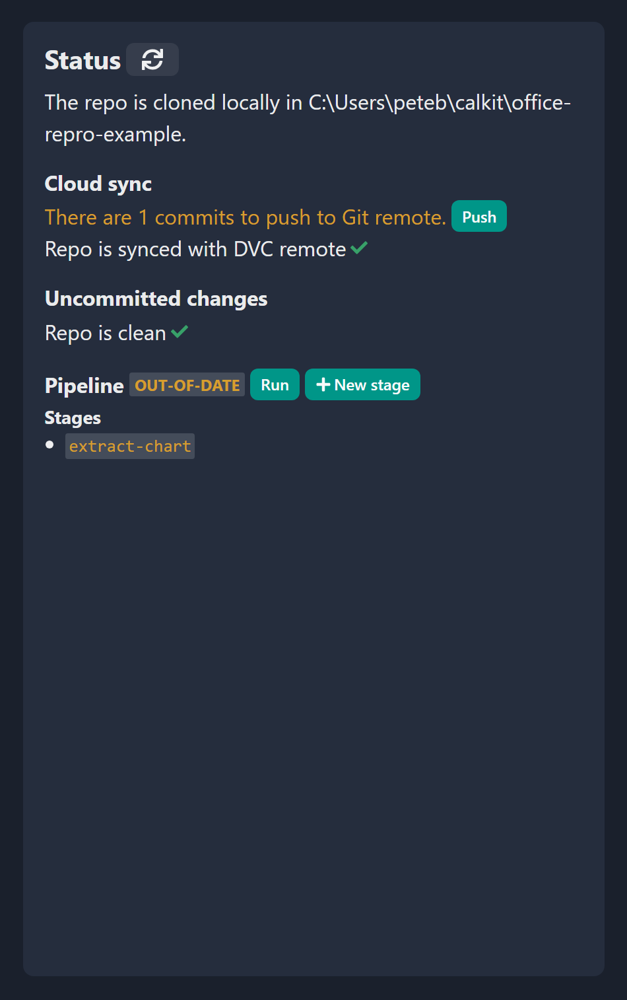

# Local server for GUI interaction

Calkit includes a local server for interacting with projects locally via the
Calkit Cloud UI ([calkit.io](https://calkit.io)).
It can be launched with:

```sh
calkit local-server
```

If you then navigate to the project homepage on
[calkit.io](https://calkit.io) and visit the "local machine"
tab,
you'll be able to visually perform tasks like committing and ignoring files,
running the pipeline, adding stages to the pipeline,
and pushing to the cloud.

This feature is used in the [Microsoft Office tutorial](tutorials/office.md).

{ width="450px" }
/// caption
The local server status widget on the Calkit Cloud UI.
///
