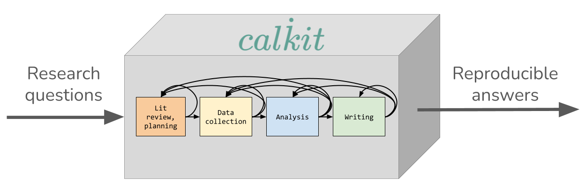

# _Calkit_: Continuously integrated, transparent, reproducible science in the age of agentic AI

Generative AI is making it much cheaper to produce research outputs, while the
reproducibility crisis remains unsolved ([only 12% of studies share
code](https://doi.org/10.1371/journal.pone.0311493), and even fewer share code
that is quick to verify). As the bottleneck is shifting from producing outputs
to checking that those outputs are trustworthy, it’s now more important than
ever to make it intuitive and enjoyable to work transparently and reproducibly,
both for humans and AI agents.

Rather than assuming we should simply teach scientists software development
tools and platforms and leave them to assemble their own workflows (the status
quo, which seems to have saturated), Calkit provides a vertically-integrated,
research-focused experience right out of the box: reference management, version
control (including large data files), computational environments, pipeline
automation, and a web-based, self-hostable collaboration platform.

Calkit is designed to help individuals work more efficiently by allowing all
stages of research—from asking questions, to data collection and analysis, to
publication—to live together in the same project, breaking down silos that slow
down iteration while allowing more inclusive collaboration, i.e., from those
who don’t want to or need to learn complex tools like Git. A Calkit project
includes the research article, not only supplements it, and is intended to be
shipped whole, providing full context and lighting fast verifiability, by
linking all evidence for answers to research questions back to reproducible
calculations.

## A success story

Rebecca McCabe recently finished her PhD in Mechanical Engineering at Cornell.
She used Calkit to create a single-button reproducible pipeline that integrated
MATLAB, Python, Julia, LaTeX, and more. She used Calkit’s Overleaf integration
to allow collaborators to contribute without learning Git.

## Where we're heading and what support we need

Calkit is developed and operated in a very lean and efficient manner. We’re
currently supported with 25% of a Sr. Research Software Engineer’s capacity
provided by the Schmidt Academy for Software Engineering at Caltech. Google
Cloud has generously provided credits to run the cloud infrastructure for a
year, and we need \$5k to stay running for another.

With an MVP in place serving a handful of users, we now need to do some
training and community building by hosting workshops, starting around Southern
California and Boston. These will be focused on computational reproducibility
principles, with Calkit positioned as one, not the only way to achieve them.
Through these efforts we’re looking to 10x our user base and continue to evolve
the software to increase the number of comprehensive, transparent,
single-button reproducible research projects released alongside papers. To do
this, we’re seeking \$75k for 2027\.

## Learn more

To learn more about Calkit, you can check out [the
docs](http://docs.calkit.org) and try out the web platform at
[calkit.io](http://calkit.io).
