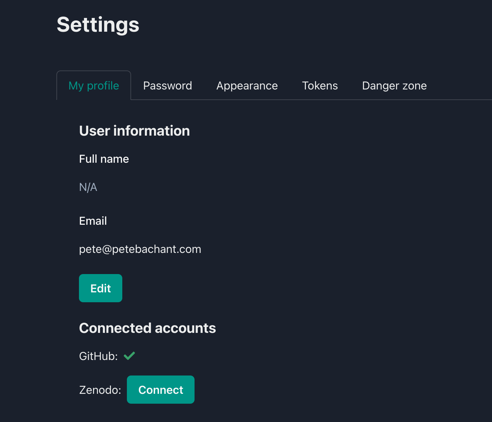

# Releasing/archiving projects and artifacts

When the project has reached an important milestone, e.g.,
a journal article is ready for submission,
a release should be created to archive the relevant artifacts
with a persistent identifier like a digital object identifier (DOI).
The archived release should then be cited in the article
so readers can follow the citation back to the project
files in order to reproduce or reuse the results.

## Integrating with Zenodo

Calkit can archive whole projects or individual artifacts to
[Zenodo](https://zenodo.org).
To enable this functionality,
you will either need to connect your Zenodo account with the Calkit Cloud or
create a Zenodo personal access token (PAT) and set it
in your machine's Calkit config or as an environmental variable.

### Option 1: Connecting to the Calkit Cloud

Visit the [Calkit Cloud user settings page](https://calkit.io/settings)
and click the connect button to authorize the Calkit app to upload to
Zenodo on your behalf.

{ width="500px" }
/// caption
The Calkit Cloud user settings page.
///

### Option 2: Using a Zenodo PAT

If you don't already have a Zenodo PAT,
first create one in your
[Zenodo account settings](https://zenodo.org/account/settings/applications/),
then call:

```sh
calkit config set zenodo_token {paste Zenodo token here}
```

Alternatively,
you may set your token as either the `ZENODO_TOKEN` or `CALKIT_ZENODO_TOKEN`
environmental variable.

## Creating a release of the project

To create a new release of the entire project, execute:

```sh
calkit new release --name submitted-paper
```

The release name (`submitted-paper` above)
should accurately and descriptively identify the release.
For a research project, it might be better to use names of milestones
rather than simple `v1`, `v2`, etc.,
You can also use the `--description` flag to add more details.

When this is called, Calkit will:

- Compress and upload all files kept in Git and DVC to Zenodo,
  which will produce a DOI,
  ensuring the release can be accessed even if the repo is relocated.
- Create a Git tag. This can be used to create a release on GitHub if desired.
- Save the MD5 checksums of files kept in DVC in
  `.calkit/releases/{release_name}/dvc-md5s.yaml`.
  These can be used to populate the DVC cache from Zenodo later on.
- Create a `CITATION.cff` file to make the project easier to cite.
- Add a badge to the project's `README.md` file showing the release's DOI.
- Add the release to the `releases` section of the `calkit.yaml` file.
- Add a BibTeX entry for the release to a references file
  (`references.bib` by default).
- Create a GitHub release with a link to the Zenodo record.

## Releasing other types of artifacts individually

To release only one artifact, e.g., a dataset or publication,
execute:

```sh
calkit new release \
    --name my-publication-v1 \
    --kind publication \
    path/to/the/publication.pdf
```
