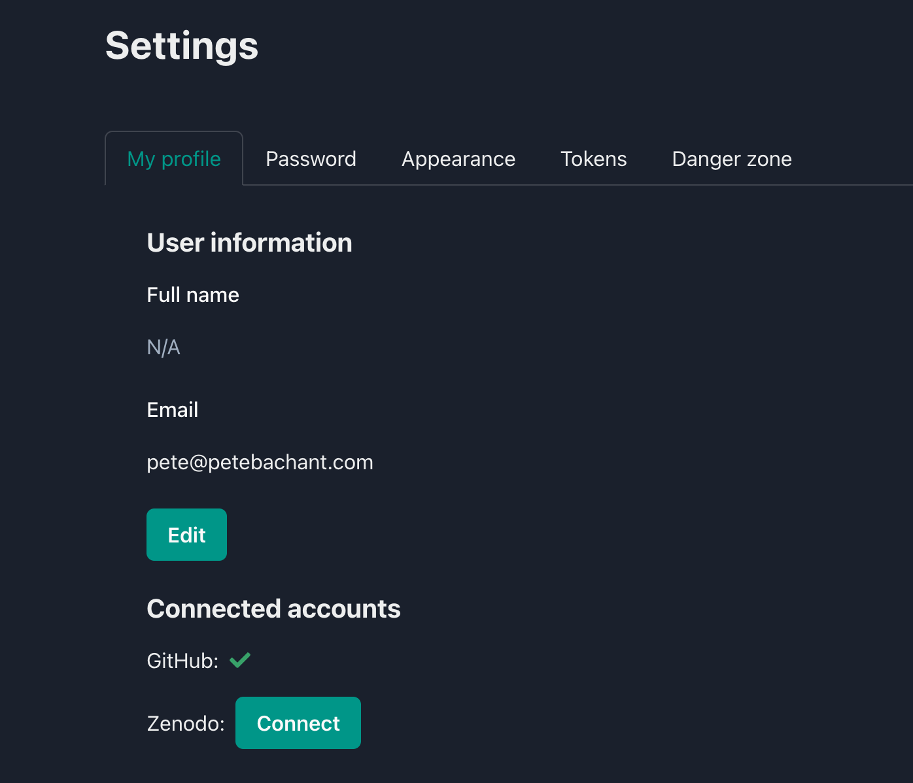

# Releasing/archiving projects and artifacts

When the project has reached an important milestone, e.g.,
a journal article is ready for submission,
a release should be created to archive the relevant artifacts
with a persistent identifier like a digital object identifier (DOI).
The archived release should then be cited in the article
so readers can follow the citation back to the project
files in order to reproduce or reuse the results.

## Integrating with Zenodo

Calkit can archive whole projects or individual artifacts to
[Zenodo](https://zenodo.org).
To enable this functionality,
you will either need to connect your Zenodo account with the hub or
create a Zenodo personal access token (PAT) and set it
in your machine's Calkit config or as an environmental variable.

### Option 1: Connecting to the hub

Visit the [hub user settings page](https://calkit.io/settings)
and click the connect button to authorize the Calkit app to upload to
Zenodo on your behalf.

{ width="500px" }
/// caption
The hub user settings page.
///

### Option 2: Using a Zenodo PAT

If you don't already have a Zenodo PAT,
first create one in your
[Zenodo account settings](https://zenodo.org/account/settings/applications/),
then call:

```sh
calkit config set zenodo_token {paste Zenodo token here}
```

Alternatively,
you may set your token as either the `ZENODO_TOKEN` or `CALKIT_ZENODO_TOKEN`
environmental variable.

## Creating a release of the project

To create a new release of the entire project, execute:

```sh
calkit new release --name submitted-paper
```

The release name (`submitted-paper` above)
should accurately and descriptively identify the release.
For a research project, it might be better to use names of milestones
rather than simple `v1`, `v2`, etc.,
You can also use the `--description` flag to add more details.

When this is called, Calkit will:

- Compress and upload all files kept in Git and DVC to Zenodo,
  which will produce a DOI,
  ensuring the release can be accessed even if the repo is relocated.
- Create a Git tag. This can be used to create a release on GitHub if desired.
- Save the MD5 checksums of files kept in DVC in
  `.calkit/releases/{release_name}/dvc-md5s.yaml`.
  These can be used to populate the DVC cache from Zenodo later on.
- Create a `CITATION.cff` file to make the project easier to cite.
- Add a badge to the project's `README.md` file showing the release's DOI.
- Add the release to the `releases` section of the `calkit.yaml` file.
- Add a BibTeX entry for the release to a references file
  (`references.bib` by default).
- Archive the images of any Docker environments built from a Dockerfile in
  the project (see [Archiving Docker images](#archiving-docker-images)).
- Create a GitHub release with a link to the Zenodo record.

## Archiving Docker images

A registry makes no promise to keep an image forever,
and an image built from a Dockerfile can't be rebuilt to the same bytes once
the packages it installs have moved on,
so a project release carries its Docker images itself.

For each environment whose image is built in the project,
Calkit exports the image with `docker save`
and uploads it to the record alongside the project archive as
`docker-image-{environment_name}.tar.gz`.
The images are uploaded as their own files rather than being folded into
`archive.zip`, so that a reader who only wants the data doesn't have to
download several gigabytes of image, and vice versa.

Calkit also writes
`.calkit/releases/{release_name}/docker-images.yaml`,
which is committed to Git,
recording for each image its SHA-256 ID, the environment and image name,
the file it was uploaded as, its architecture, and its layers:

```yaml
sha256:928d7b8bd38205143f...:
  environment: blsim
  image: blsim
  path: docker-image-blsim.tar.gz
  architecture: arm64
  os: linux
  layers:
    - sha256:...
    - sha256:...
  repo_digests:
    - ghcr.io/someone/some-project/blsim@sha256:...
```

This is what lets a checkout of the project find its way back to the image
later, described in
[Fetching images](environments.md#how-images-are-fetched).

The archive is a gzipped tarball written by `docker save`.
Its contents follow the
[OCI image layout](https://github.com/opencontainers/image-spec/blob/main/image-layout.md)
--- an `oci-layout` marker, an `index.json`, and content-addressed blobs
under `blobs/sha256/` --- so it can be read by any OCI-aware tool, not only
Docker, with a legacy `manifest.json` written alongside for older versions
of Docker to load.
Note that this format comes from the Docker daemon rather than from Calkit:
a daemon using the containerd image store writes an OCI layout, while one
using the legacy image store writes the older Docker image format instead.
Either loads with `docker load`.

<!-- prettier-ignore -->
!!! note

    Images are archived for whole-project releases published to Zenodo or
    CaltechDATA. Releases of a single artifact don't include them, and
    neither do internal (local) releases. Pass `--no-docker-images` to skip
    them, e.g., if an image is large and already published somewhere durable.
    `docker save` exports the image for the platform it's run on, so a
    multi-platform image is archived for one platform only.

## Licenses and authors

The archived record needs both license and author metadata.

Calkit detects the project's license(s) automatically from a `LICENSE` file
(common names like `LICENSE.txt`, `LICENSE.md`, and `COPYING` are also
recognized), supporting common licenses such as MIT, Apache-2.0, the BSD
family, the GPL family, CC-BY-4.0, and others.
If no license is found, you'll be prompted to generate a sensible default
(MIT for code, CC-BY-4.0 for other content).
You can also specify license(s) explicitly with one or more `--license`
options using [SPDX identifiers](https://spdx.org/licenses), e.g.,
`--license mit`.

Authors are stored in the project's `CITATION.cff` file, which is the single
source of truth for citation authors and is itself created/updated by Calkit
on each project release.
When creating a release, Calkit reads the authors from `CITATION.cff`; if
none are defined yet, it will prompt you to enter them and write them to
`CITATION.cff` (existing author entries are always preserved).

## Releasing other types of artifacts individually

To release only one artifact, e.g., a dataset or publication,
execute:

```sh
calkit new release \
    --name my-publication-v1 \
    --kind publication \
    path/to/the/publication.pdf
```

## Releasing to CaltechDATA

[CaltechDATA](https://data.caltech.edu/)
is an instance of the
[InvenioRDM](https://inveniosoftware.org/products/rdm/)
software that powers Zenodo,
so archiving there is a similar process.

First, set your CaltechDATA PAT with:

```sh
calkit config set caltechdata_token {paste CaltechDATA token here}
```

Then, in the `new release` command, simply add the `--to caltechdata`
option.
