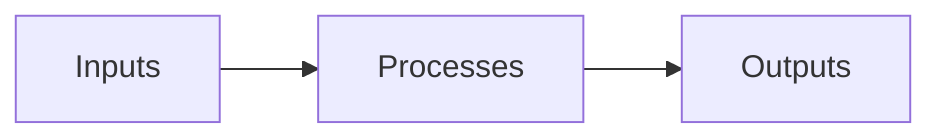

# Reproducibility

Reproducibility can be defined as:

> Given the inputs and process definitions, it's possible to generate the
> same outputs.

Basically this means that if you have the code and data and run them,
you get the same figures, tables, numerical results, etc.

Inputs are not limited to code and data, however.
They may include, but are not limited to:

- Raw data files
- Source code
- Configuration files
- Text files, e.g., for a manuscript
- Diagrams created by drawing
- Computational environment specifications

In other words, the inputs are _primary artifacts_.
They were created from nothing or acquired from elsewhere,
either by humans or AI agents.

The main output of a research project is the article itself,
which is typically in PDF form.
This output is typically composed of the text input and some intermediate
outputs or _secondary artifacts_
like figures, tables, and numerical results.

Process definitions describe how to turn the inputs into the outputs.
For example,

> Run the analysis script with these arguments.

> Create the computational environment from the requirements.txt file.

> Compile the LaTeX source file to generate the PDF.

## Measuring reproducibility

A more measurable definition of reproducibility would be:

> The inverse of the time it takes to verify the outputs
> truly reflect the inputs and process definitions.

This definition opens up the possibility of not needing to rerun expensive
processes by having some sort of traceability on the outputs,
e.g., a `dvc.lock` file.

In other words,
to verify the output truly reflects the inputs and process definitions,
we need to be able to trace through the entire path.
We need to know the exact _provenance_.

From this perspective,
a study that shares no code and data will be very hard to reproduce,
if not impossible.
One that shares data but no code will be a little better.
However, sharing code, environment lock files, and a fully-automated
pipeline with file content-based tracking
is the gold standard.
Barring misconduct,
provenance can be verified with a single command
(`calkit status` for a Calkit project).

## Consequences of poor reproducibility

On obvious consequence of poor reproducibility is that
the research may not be trustworthy.
The steps claimed to have been taken to produce evidence to back up a
conclusion may not have actually been taken as described.
This could simply be due to a lack of knowledge, memory,
or they may be described imprecisely.
Peer review is supposed to catch these sorts of instances in theory,
but doing a reproducibility check is often a large undertaking.

Furthermore,
poor reproducibility indicates inefficient and error-prone project management
practices.
If multiple scripts/notebooks/commands need to be rerun to verify all outputs
are up-to-date,
it's more likely that they will be skipped,
especially if they are expensive.
The project may therefore end up in an inconsistent state,
which may lead to publication of incorrect results.
