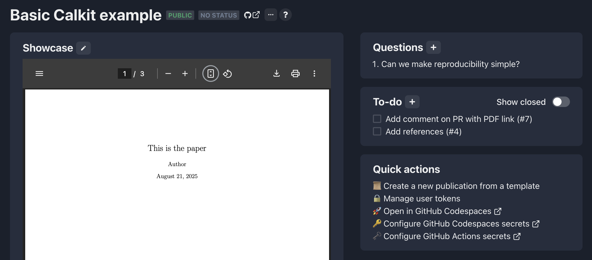
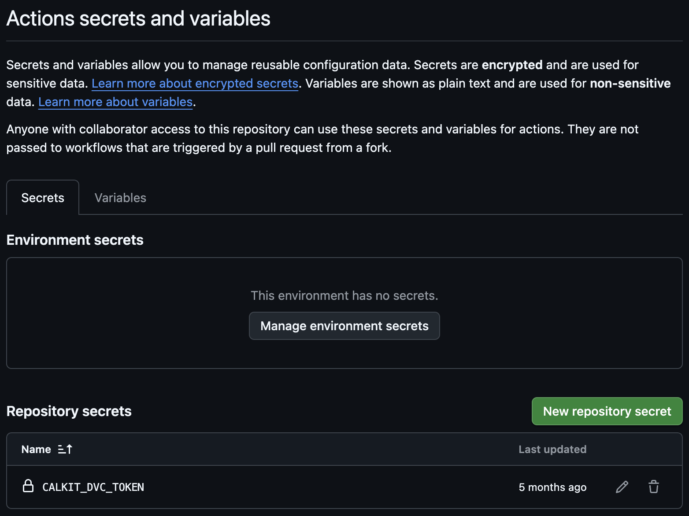

# Running Calkit in GitHub Actions

A project can be set up to automatically run the pipeline every time a
change is pushed, either to the main branch or on a pull request,
using GitHub Actions.
The latter allows for inspection of outputs before merging into main.

To get started, generate a DVC token and set it in your GitHub Actions
secrets as `CALKIT_DVC_TOKEN`,
either at your account or project level.
On calkit.io, there are shortcuts on the project page for managing both
Calkit tokens and GitHub Actions secrets:






Next, add a workflow to the project in the `.github/workflows` folder.
For example, we can put the content below into `.github/workflows/run.yml`:

```yaml
name: Run pipeline

on:
  push:
    branches:
      - main
  pull_request:

permissions:
  contents: write

# Make sure we only ever run one per branch so we don't have issues pushing
# after running the pipeline
concurrency:
  group: calkit-run-${{ github.ref }}
  cancel-in-progress: false

jobs:
  main:
    name: Run
    runs-on: ubuntu-latest
    steps:
      - uses: actions/checkout@v4
        with:
          # For PRs, checkout the head ref to avoid detached HEAD
          ref: ${{ github.head_ref || github.ref_name }}
          token: ${{ secrets.GITHUB_TOKEN }}
      - name: Configure Git credentials
        run: |
          git config user.name github-actions[bot]
          git config user.email 41898282+github-actions[bot]@users.noreply.github.com
      - name: Setup uv
        uses: astral-sh/setup-uv@v5
      - name: Install Calkit
        run: uv tool install calkit-python
      - name: Run Calkit
        uses: calkit/run-action@v1
        with:
          dvc_token: ${{ secrets.CALKIT_DVC_TOKEN }}
```

This particular example installs Calkit with uv,
meaning `uv` and `uv-venv` environment types will work without any additional
configuration.
Docker is also installed by default on the `ubuntu-latest` machine.
If other environment types are used in the project,
setup steps may be necessary for those, e.g.,
[`setup-miniconda`](https://github.com/marketplace/actions/setup-miniconda)
or [`install-juliaup`](https://github.com/marketplace/actions/install-juliaup).

By default, the Calkit GitHub Action will run the pipeline and save results.
This is why the workflow needs write permissions and configures Git
credentials to act as the GitHub Actions bot.
The workflow also limits concurrency so multiple jobs don't attempt to push
to the same branch at the same time.

It's possible to configure the action to not save results, e.g., if you
just want to check that the pipeline can run without errors.
See the [documentation](https://github.com/marketplace/actions/run-calkit)
for all available options.
