# Collaborating on a LaTeX document with GitHub Codespaces

Research projects often involve producing some sort of LaTeX document,
e.g., a conference paper, slide deck, journal article, proposal,
or multiple of each.
Collaborating on one of these can be painful,
though there are web- or cloud-based tools to help,
the most popular of which is probably
[Overleaf](https://overleaf.com).
Overleaf is pretty neat,
but the free version is quite limited in terms of versioning, collaboration,
and offline editing.
Most importantly,
I feel like it's only really suited to pure writing projects.
Research projects involve writing for sure,
but they also involve (often iteratively)
collecting and analyzing data, running simulations, creating figures, etc.,
which are outside Overleaf's scope.

[Calkit](https://github.com/calkit/calkit)
on the other hand is a research project framework encompassing
all of the above,
including writing,
and is built upon tools that can easily run both in the cloud and locally,
on- or offline,
for maximum flexibility.
Here we're going to focus doing everything in a web browser though.
We'll set up a collaborative LaTeX editing
environment with Calkit and
[GitHub Codespaces](https://github.com/features/codespaces),
a container-based virtual machine service.

**Disclosure:** There is a paid aspect of the Calkit Cloud,
which I manage,
to help with the costs of running the system,
and to prevent users for pushing up unreasonable amounts of data.
However, the software is open source and there is a free plan
that provides more than enough storage to do what we'll do here.

## Create the project

In order to follow along, you'll need a GitHub account,
so if you don't have one,
[sign up for free](https://github.com/signup).
Then head to [calkit.io](https://calkit.io),
sign in with GitHub,
and click the "create project" button.
Upon submitting, Calkit will create a new GitHub repository for us,
setup [DVC (Data Version Control)](https://dvc.org) inside it,
and create a so-called "dev container" configuration from
which we can spin up our GitHub Codespace and start working.

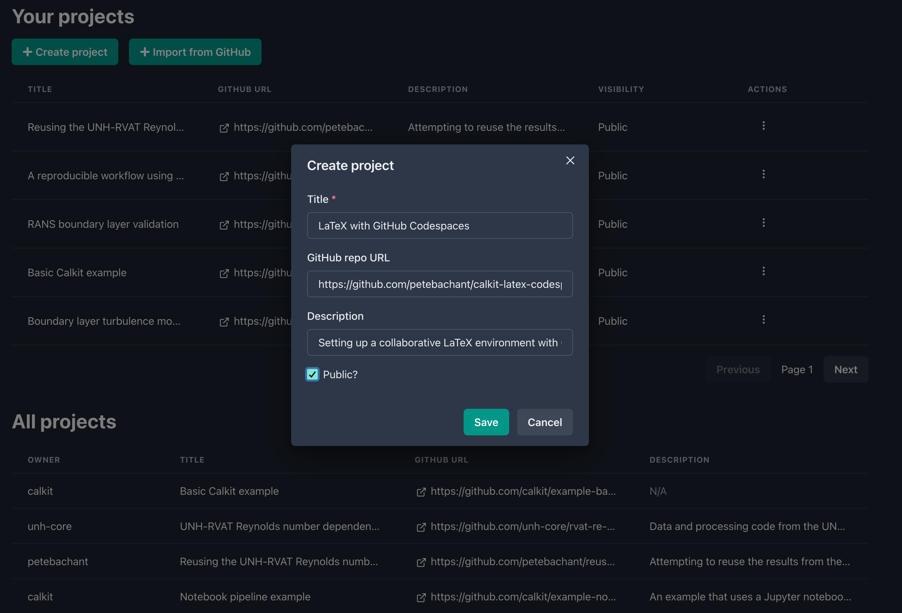

## Add a new publication to the project

Click the quick action link on the project homepage
to "create a new publication from a template."
In the dialog,
select the `latex/article` template,
and fill in the rest of the required information.
This will add a LaTeX article to our repo and a build stage to our
DVC pipeline,
which will automatically create
a TeX Live Docker environment to build the document.
Here we'll create the document in a new folder called `paper`:

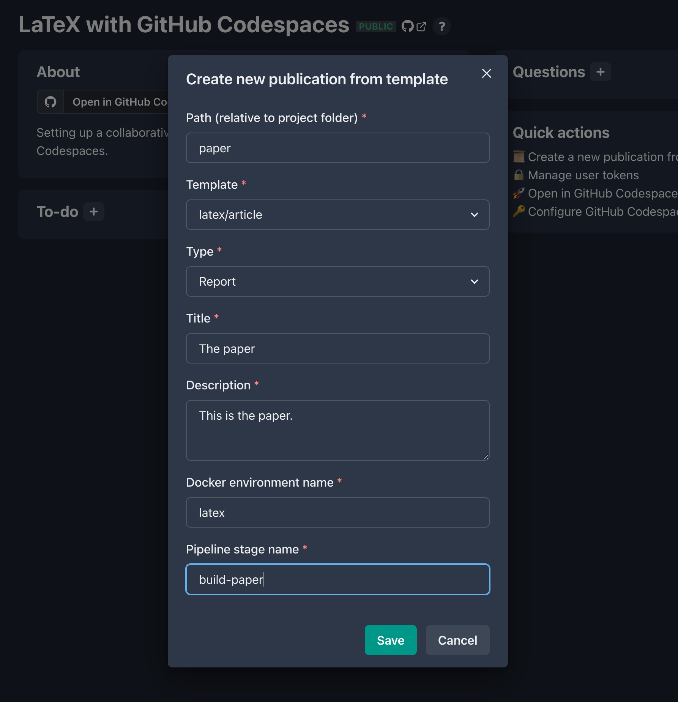

Keep in mind that you'll be able add different LaTeX style and config
files later on if the generic article template doesn't suit your needs.
Also, if you have suggestions for templates you think should be included,
drop a note in a
[new GitHub issue](https://github.com/calkit/calkit/issues/new).

## Create the Codespace

In order to push artifacts like PDFs up to the Calkit Cloud's DVC remote,
we will need a token and we'll need to set it as a secret for the Codespace.
On the Calkit project homepage you'll see a link in the quick actions
section for managing user tokens.

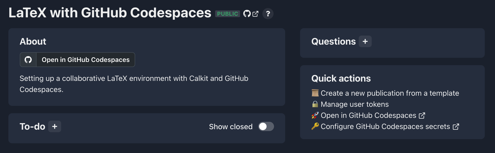

Head over there and create one, selecting "DVC" as the purpose.
Save this in a password manager if you have one,
then head back to the project homepage and click the quick action link
to configure GitHub Codespaces secrets for the project.
Create a secret called `CALKIT_DVC_TOKEN`
and paste in the token.

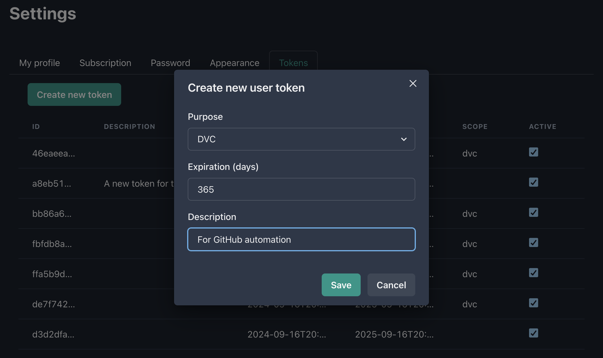

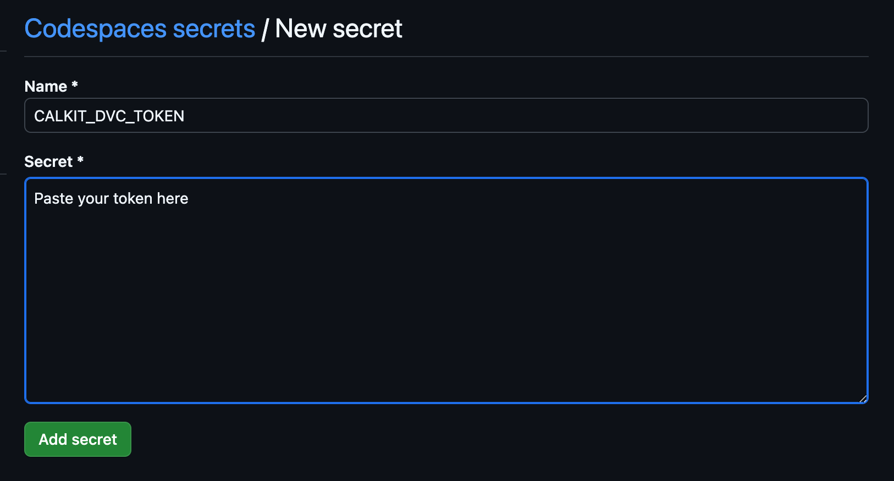

Next, from the project homepage,
click "Open in GitHub Codespaces."
Alternatively, if you haven't created your own project,
you can
[create your own Codespace in mine](https://github.com/codespaces/new/petebachant/calkit-latex-codespaces?quickstart=1).

Once created, we'll see an in-browser
[Visual Studio Code (VS Code)](https://code.visualstudio.com/)
editor, which will have access to our project repository
and will be able to compile the LaTeX document.
Consider this your very own Linux virtual machine in the cloud for working
on this project.
You can update settings, add extensions, etc.
You have total control over it.
Note that GitHub does
[charge for Codespaces](https://docs.github.com/en/billing/managing-billing-for-your-products/managing-billing-for-github-codespaces/about-billing-for-github-codespaces),
but the free plan limits are reasonably generous.
It's also fairly easy to run the same dev container configuration locally in
in VS Code.

It might take few minutes to start up the first time
as the Codespace is created,
so go grab a coffee or take the dog for a walk.

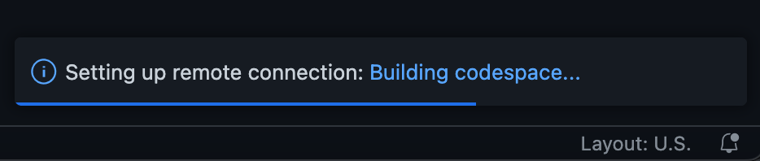

## Edit and build the document

After the Codespace is built and ready,
we can open up `paper/paper.tex` and start writing.

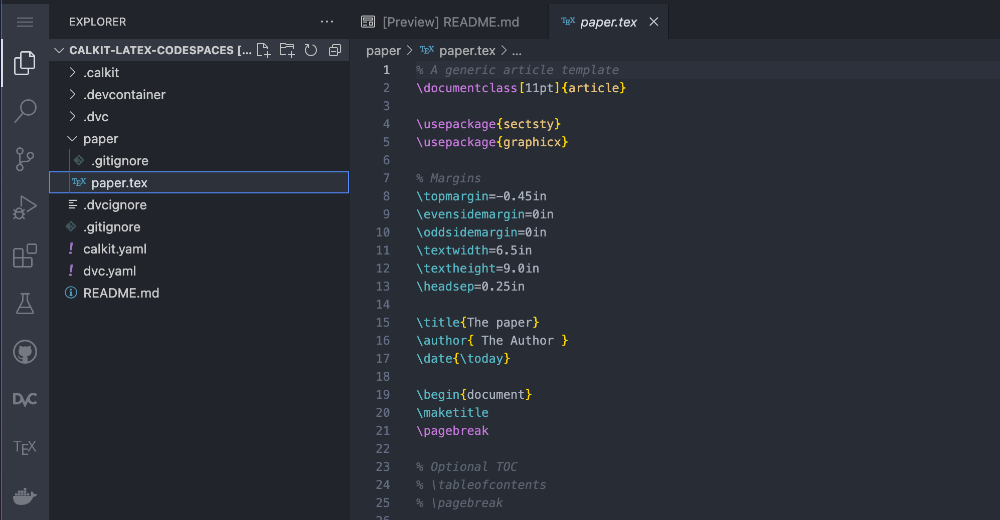

If you look in the upper right hand corner of the editor panel,
you'll see a play button icon added by the
[LaTeX Workshop](https://github.com/James-Yu/LaTeX-Workshop)
extension.
Clicking that will rebuild the document.
Just to the right of that button is one that will open the PDF in
split window,
which will refresh on each build.

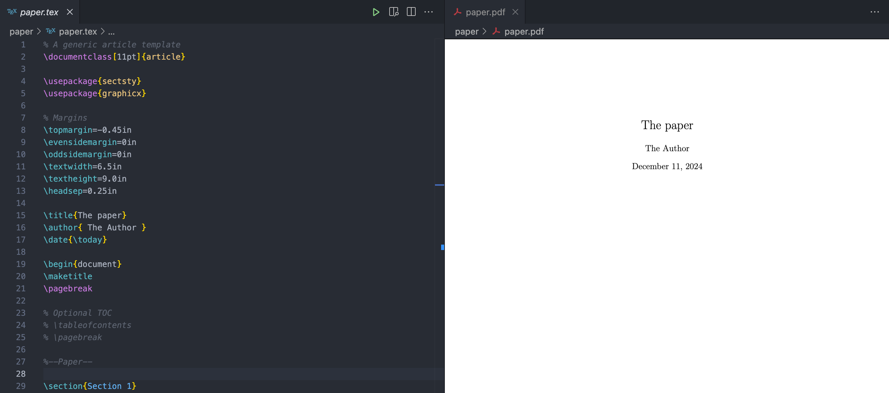

Note that the play button will run the entire pipeline
(like calling `calkit run` from a terminal,)
not just the paper build stage,
so we can add more stages later, e.g., for creating figures,
or even another LaTeX document,
and everything will be kept up-to-date as needed.
This is a major difference between this workflow and that of a typical
LaTeX editor, i.e.,
that the entire project is treated holistically.
So for example,
there's no need to worry about if you forgot to rerun the paper build
after tweaking a figure---it's all one pipeline.
See
[this project](https://calkit.io/calkit/example-basic/workflow)
for an example,
and check out the
[DVC stage documentation](https://dvc.org/doc/user-guide/pipelines/defining-pipelines#stages)
for more details on how to
build and manage a pipeline.

## Break lines in a Git-friendly way

This advice is not unique to cloud-based editing,
but it's worth mentioning anyway.
When writing documents that will be versioned with Git,
make sure to break lines properly
by splitting them at punctuation or otherwise breaking into one
logical phrase per line.
This will help when viewing differences between versions
and proposed changes from collaborators.
If you write paragraphs as one long line and let them "soft wrap,"
it will be a little more difficult.

So, instead of writing something like:

```
This is a very nice paragraph. It consists of many sentences, which make up the paragraph.
```

write:

```
This is a very nice paragraph.
It consists of many sentences,
which make up the paragraph.
```

The compiled document will look the same.

## Commit and sync changes

For better or for worse,
working with Git/GitHub is different from other systems
like Google Docs, Overleaf, or Dropbox.
Rather than syncing our files automatically,
we need to deliberately "commit" changes to create a snapshot
and then sync or "push" them to the cloud.
This can be a stumbling block when first getting started,
but one major benefit is that it makes one stop and think about how to
describe a given set of changes.
Another benefit is that every snapshot will be available forever,
so if you create lots of them, you'll never lose work.
In a weird mood and ruined a paragraph that read well yesterday?
Easy fix---just revert the changes.

The VS Code interface has a built-in graphical tool for working with Git
and GitHub,
which can make things a little easier compared to learning the
command-line interface (CLI.)
If we make some changes to `paper.tex`,
we can see a blue notification dot next to the source control icon in the
left sidebar.
In this view we can see there are two files that have been changed,
`paper.tex` and `dvc.lock`,
the latter of which is a file DVC creates to keep track of the pipeline,
and shows up in the "Staged Changes" list,
a list of files that would be added to a snapshot if we were
to create a commit right now.

We want to save the changes both this file and `paper.tex` in one commit,
so let's stage the changes to `paper.tex`,
write a commit message, and click commit.

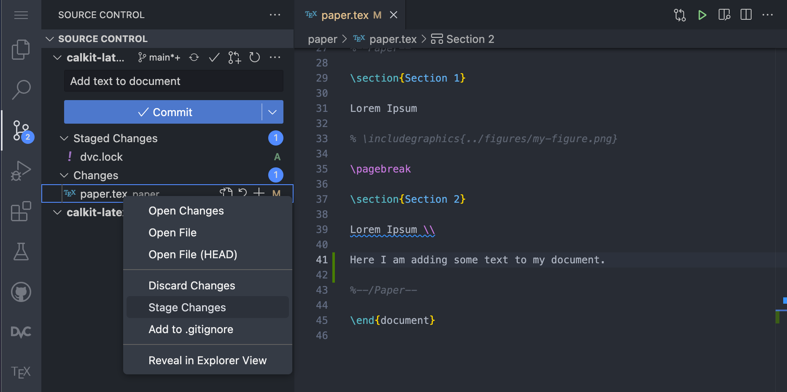

After committing we'll see a button to sync the changes with the cloud,
which we can go ahead and click.
This will first pull from and then push our commits up to GitHub,
which our collaborators will then be able to pull into their own workspaces.

### Push the PDF to the cloud

The default behavior of DVC is to not save
pipeline outputs like our compiled PDF to Git,
but instead commit them to DVC,
since Git is not particularly good at handling large and/or binary files.
The Calkit Cloud serves as a "DVC remote" for us to push these artifacts
to back them up and make them available to others with access to the project.

If we go down to the terminal and run `calkit push`,
we'll push our DVC artifacts (just the PDF at this point)
up to the cloud as well,
which will make our PDF visible in the publications section of
the project homepage.
Note that `calkit push` will also send the Git changes to GitHub,
completely backing up the project.

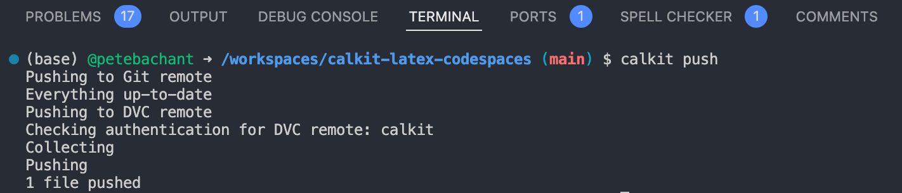

Later on,
if you end up adding things like large data files for analysis,
or even photos and videos from an experiment,
these can also be versioned with DVC and
backed up in the cloud.

## Collaborate concurrently

What we've seen so far is mostly an individual's workflow.
But what if we have multiple people working on the document at the same time?
Other cloud-based systems like Google Docs and Overleaf
allow multiple users to edit a file simultaneously,
continuously saving behind the scenes.
My personal opinion is that concurrent collaborative editing is
usually not that helpful,
at least not on the same paragraph(s).
However, if you really like the Google Docs experience,
you can setup the Codespace for
[live collaboration](https://docs.github.com/en/codespaces/developing-in-a-codespace/working-collaboratively-in-a-codespace).
Otherwise, collaborators can create their own Codespaces from the same
configuration just like we created ours.

Git is actually quite good at automatically merging changes together,
but typically you'll want to make sure no two people are working on the same
lines of text at the same time.
You'll need to communicate a little more with your collaborators
so you don't step on each other's toes and end up with merge conflicts,
which require manual fixes.
You could simply send your team a Slack message letting them know
you're working on the doc, or a given section, and avoid conflicts that way.
You could split up the work by paragraph or section,
and even use LaTeX `\input` commands in the main `.tex` file
to allow each collaborator to work
on their own file.

Git can also create different branches of the repo in order to merge them
together at a later time, optionally via GitHub pull requests,
which can allow the team to review proposed changes before they're
incorporated.
However, for many projects,
it will be easier to have all collaborators simply commit
to the main branch and continue to clean things up as you go.
If commits are kept small with descriptive messages,
this will be even easier.
Also, be sure to run `git pull` often,
either from the UI or from the terminal,
so you don't miss out on others' changes.

## Manage the project with GitHub issues

Another important aspect of collaborative writing is reviewing
and discussing the work.
I recommend using
[GitHub issues](https://docs.github.com/en/issues)
as a place to create to-do items or tasks
and discuss them,
which is particularly helpful for team members who are mostly
reviewing rather thant writing.

One approach to creating issues is to
Download the latest PDF of the document, add comments, and attach
the marked up PDF to a new GitHub issue.
A variant of this is printing it out and scanning the version with red pen
all over it.

Another approach is to create issues from within VS Code.
In the `.tex` file, you can highlight some text and create a GitHub
issue from it with the "Create Issue From Selection" command.
Open up the command palette with `ctrl/cmd+shift+p` and
start typing "issue from selection".
The command should show up at the top of the list.

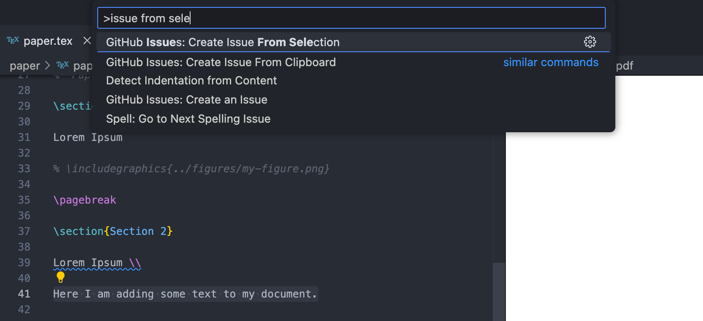

After you create a new issue,
click the GitHub icon in the left pane and look through the recent issues.
You can right click on an issue and select "Go to Linked Code" to do just
that.

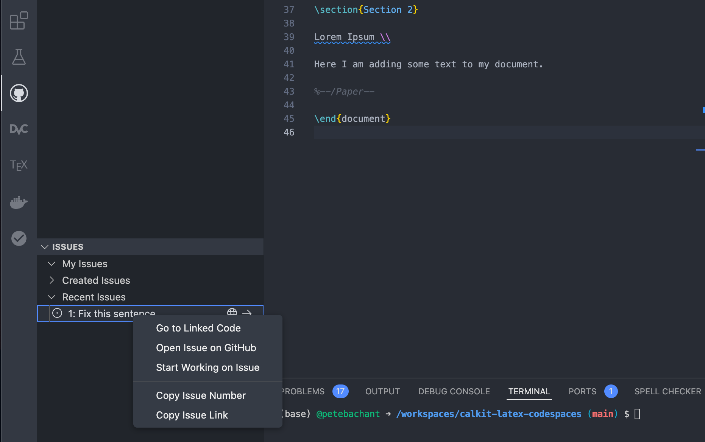

If you make a commit that addresses a given issue,
you can include "fixes #5" or "resolves #5" in the commit message,
referencing the issue number,
and GitHub will automatically close it.

For complex cases with lots of tasks and team members,
[GitHub projects](https://docs.github.com/en/issues/planning-and-tracking-with-projects/learning-about-projects/about-projects)
is a nice solution,
allowing you to put your tasks into a Kanban board or table,
prioritize them, assess their effort level, and more.
Also note that these GitHub issues will also show up in
the "To-do" section on the Calkit project homepage,
and can be created and closed from there as well.

## Conclusions

Here we set up a way to collaborate on a LaTeX document
in the cloud using GitHub Codespaces.
The process was a little more involved compared to
using a dedicated LaTeX web app
like Overleaf,
but our assumption was that this document is part of a larger
research project that involves more than just writing.
Because the document is integrated into a Calkit project,
it is built as a stage in a DVC pipeline,
which can later be extended to include other computing tasks
like creating datasets,
processing them, making figures, and more.

We also went over some tactics to help with version control,
concurrent editing,
and project management.
Though we did everything in a web browser,
this setup is totally portable.
We'll be able to work equally well locally as we can in the cloud,
allowing anyone to reproduce the outputs anywhere.
