# Using Microsoft Office

!!! note

    Many of the steps shown here use the Calkit web UI.
    However, all steps could have just as easily been performed with the
    [CLI](../cli-reference.md).

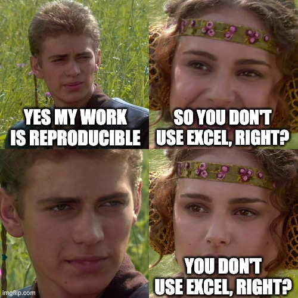
/// caption
Does using Microsoft Office always mean going to the dark side?
///

Everyone knows that when you want to get serious about reproducibility
you need to stop using Microsoft Word and Excel and become a computer hacker,
right?
There is some truth to that, that working with simpler, open source,
less interactive tools is typically better for producing permanent artifacts
and enabling others to reproduce them,
but it's not mandatory.

On the other hand, it's starting to become more and more common,
and will hopefully someday be mandatory
to share all code and data when submitting a manuscript to a journal,
so that others can reproduce the results.
This is a good thing for science overall,
but also good for individual researchers,
even though it may seem like more work.

Besides the fact that you'll probably get
[more citations](https://doi.org/10.1371/journal.pone.0230416),
which should not necessarily be a goal in and of itself given recent
controversies around citation coercion,
working reproducibly will keep you more organized and focused,
and will allow you to produce higher quality work more quickly.
I would also be willing to bet that if reviewers can reproduce your work,
your paper will get through the review process faster,
shortening the time-to-impact.

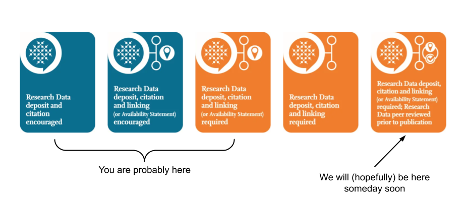
/// caption
Elsevier's research data availability standards (with annotations.)
///

Here we'll see that it's possible
to get started working reproducibly without becoming a de facto
software engineer,
that it's okay to use whatever tools you prefer so long as you
follow the relevant principles.
Inspired by the article
[Ten Simple Rules for Computational Research](https://doi.org/10.1371/journal.pcbi.1003285),
we're going focus on just two:

1. **Keep all files in version control.**
   This means a real version control system.
   Adding your initials and a number to the filename
   is kind of like a version control system, but is messy and error-prone.
   It should be easy to tell if a file has been modified since the last time
   is was saved.
   When you make a change you should have to describe that change,
   and that record should exist in the log forever.
   When all files are in a true version-controlled repository, it's like using
   "track changes" for an entire folder,
   and it doesn't require any discipline to avoid
   corrupting the history, e.g., by changing a version after it has had its
   filename suffix added.
1. **Generate permanent artifacts with a pipeline.**
   Instead of a bunch of manual steps, pointing and clicking,
   we should be able to repeatedly perform the same single action over and over
   and get the same output.
   A good pipeline will allow us to know if our output artifacts, e.g., figures,
   derived datasets, papers,
   have become out-of-date and no longer reflect their input data or
   processing procedures, after which we can run the pipeline and get them
   up-to-date.
   It also means we only need to focus on building that pipeline and running
   it. We don't need to memorize what steps to perform in what order---just
   run the pipeline.

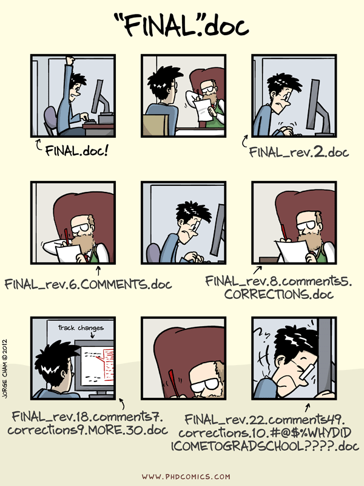
/// caption
Manual or ad hoc 'version control' (don't do this.) From phdcomics.com.
///

In order to follow rule number 1,
we are going to treat our project's repository, or "repo,"
as the one place to store everything.
Any file that has anything to do with our work on this project
goes in the repo.
This will save us time later because there will be no question about
where to look for stuff, because the answer is: in the repo.

This repo will use [Git](https:/git-scm.com) for text-based files
and [DVC](https://dvc.org) for binary files, e.g., our Excel spreadsheets
and Word documents.
Don't worry though, we're not actually going to interact with Git
and DVC directly.
This is a major sticking point for some people,
and we totally sympathize. Learning Git is a daunting task.
However, here all the Git/DVC stuff will be done for us behind the scenes.

We can start off by creating a Git (and GitHub)
repo for our project
up on [calkit.io](https://calkit.io).

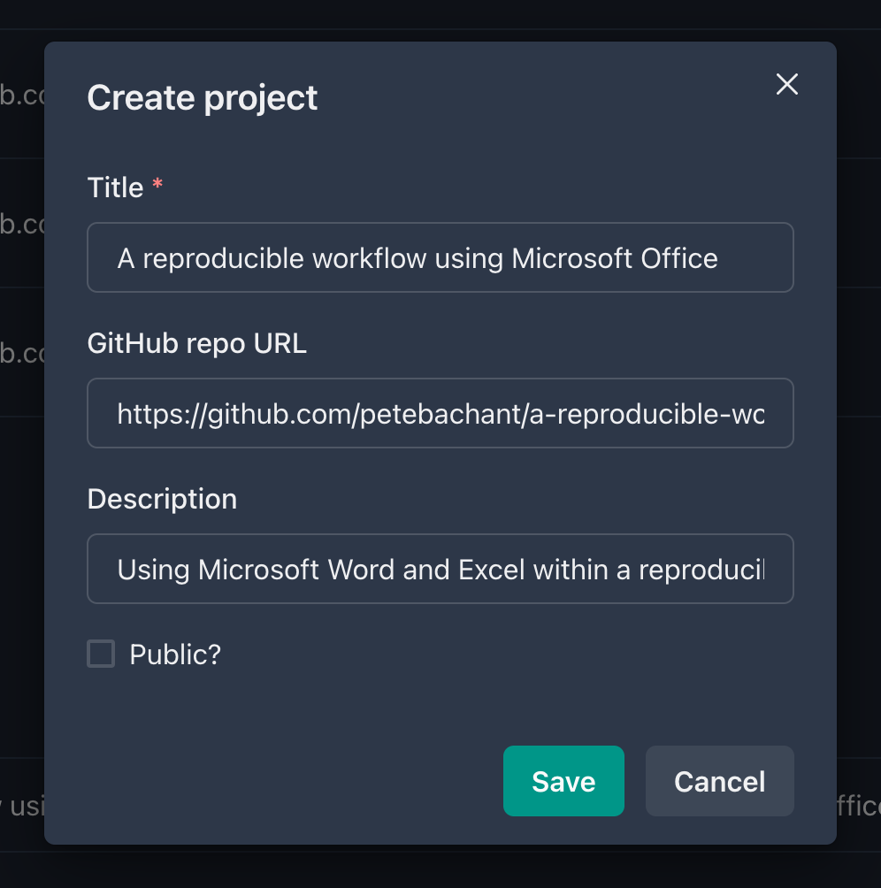{ width="450px" }
/// caption
Creating the project on calkit.io.
///

Next, we'll do the only command line thing in this whole process
and spin up a local Calkit server.
This will allow us connect to the web app and enable us to modify the project
on our local machine.
To start the server, open up a terminal or Miniforge command prompt and run:

```sh
calkit local-server
```

If we navigate to our project page on [calkit.io](https://calkit.io),
then go to the local machine page, we see that the repo has never been
cloned to our computer, so let's click the "Clone" button.

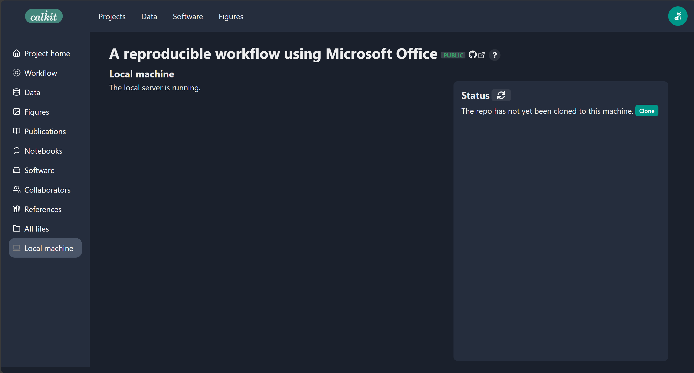
/// caption
The project's local machine page showing we haven't cloned the repo yet.
///

By default, it will be cloned somewhere
like `C:/Users/your-name/calkit/the-project-name`,
which you can see in the status.
We can also see that our repo is "clean,"
i.e., there are no untracked or modified files in there,
and that our local copy is synced with both the Git and DVC remotes,
meaning everything is backed up and we have the latest version.
We'll strive to keep it that way.

Now that we have our repository cloned locally let's create our dataset.
We are going to do this by adding some rows to an Excel spreadsheet
and saving it in our project repo as `data.xlsx`.

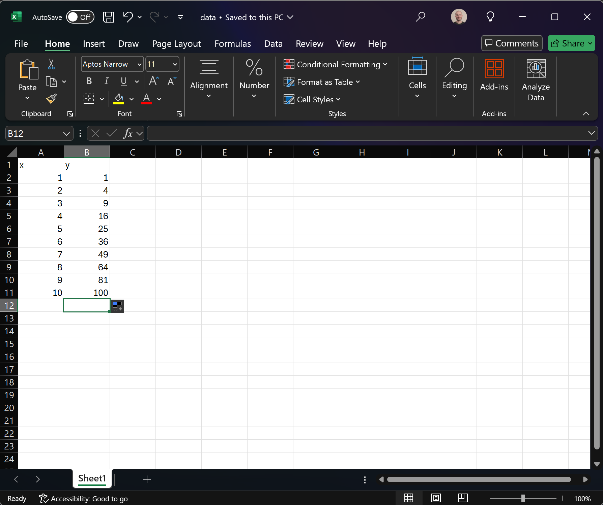
/// caption
Creating our dataset in Excel.
///

Back on the Calkit local machine page,
if we refresh the status
we see that the `data.xlsx` spreadsheet is showing up as an untracked
file in the project repo.
Let's add it to the repo by clicking the "Add" button.

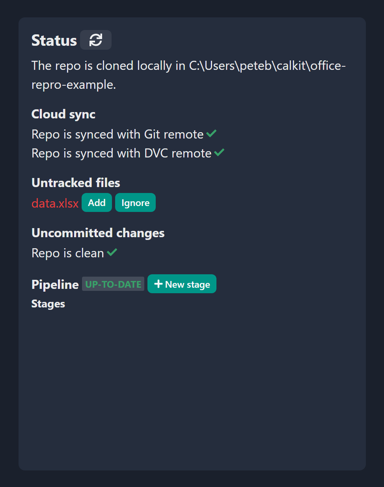{ width="450px" }
/// caption
We have an untracked file.
///

After adding and committing,
Calkit is going to automatically push to the remotes
so everything stays backed up,
and again we'll see that our repo is clean and in sync.

Now let's use Excel to create a figure.
If we go in and create a chart inside and save the spreadsheet,
we see up on the local machine page that we have a changed file.
Let's commit that change by clicking the "Commit" button
and let's use a commit message like
"Add chart to spreadsheet".

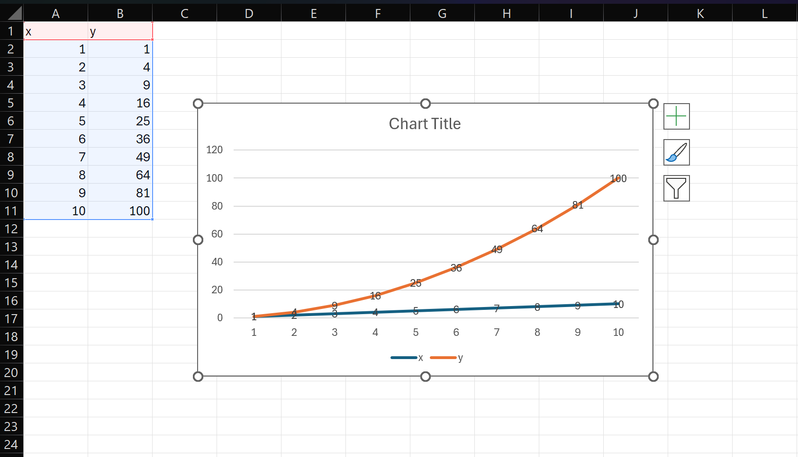
/// caption
Creating our figure in Excel.
///

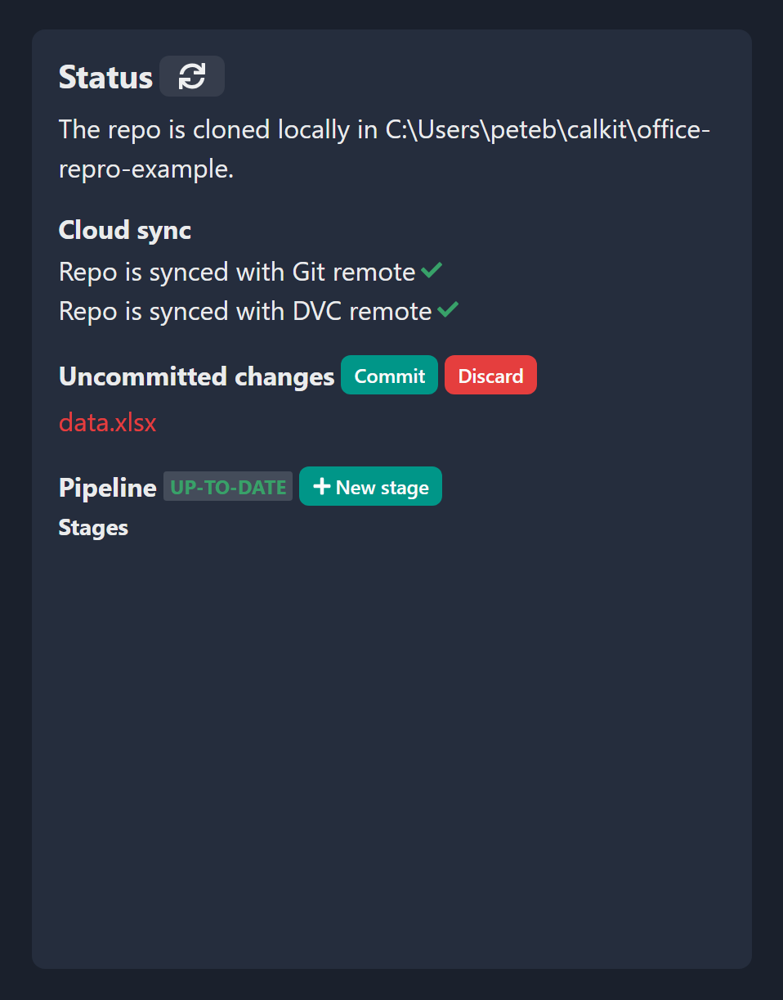{ width="450px" }
/// caption
Uncommitted changes in the repo after adding a chart to the spreadsheet.
///

At this point our data is in version control so we'll
know if it ever changes.
Now it's time for rule number 2: Generate important artifacts
with a pipeline.
At the moment our pipeline is empty,
so let's create a stage that extracts our chart from Excel into an image
and denotes it as a figure in the project.
On the web interface we see there's a button to create a new stage,
and in there are some optional stage templates.
If we select "Figure from Excel",
there will be a few fields to fill out:

1. The name of the stage. We'll use `extract-chart`, but you can call it
   whatever you like.
1. The Excel file path relative to the repo (`data.xlsx`).
1. The desired output file path for our image. We'll use `figures/chart.png`,
   but again, you can choose whatever makes sense to you.
1. The title and description of our figure.

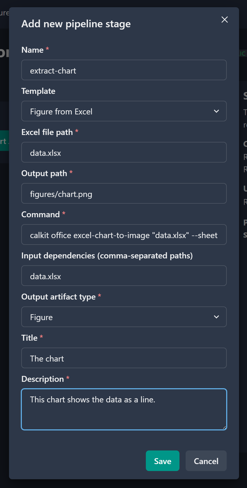{ width="450px" }
/// caption
Creating a new pipeline stage to extract our chart from Excel.
///

After saving the stage and refreshing the status we'll see that the pipeline
is out-of-date,
which makes sense.
We added a stage but haven't yet run the pipeline.
So let's do that by clicking the "Run" button.

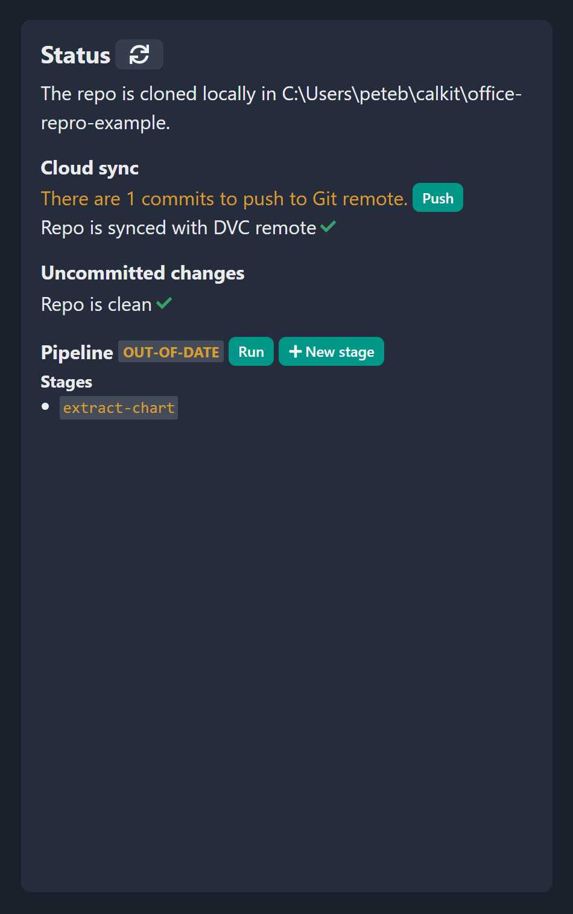{ width="450px" }
/// caption
The pipeline is out-of-date after adding a stage.
///

After the pipeline has been run we can see there are some uncommitted
changes in the repo, so let's commit them with a message that makes sense,
e.g., "Extract figure from data.xlsx".
We should again be in our happy state, with a clean repo synced with the cloud,
and a pipeline that's up-to-date.

To wrap things up, we're going to use this figure in a paper,
written using Microsoft Word.
So, find a journal with a Microsoft Word (`.docx`) submission template,
download that, and save it in the repo.
In this case, I saved the IOP Journal of Physics
template generically as `paper.docx`,
since in the context of this project, it doesn't need a special name,
unless of course `paper.docx` would somehow be ambiguous.
We can then follow the same process we followed with
`data.xlsx` to add and commit the untracked `paper.docx` file to the repo.

Now let's open up the Word document and insert our PNG image exported
from the pipeline.
Be sure to use the "link to file" or "insert and link"
option, so Word doesn't duplicate the image data inside
the document.
This will allow us to update the image externally and not need to
reimport into Word.

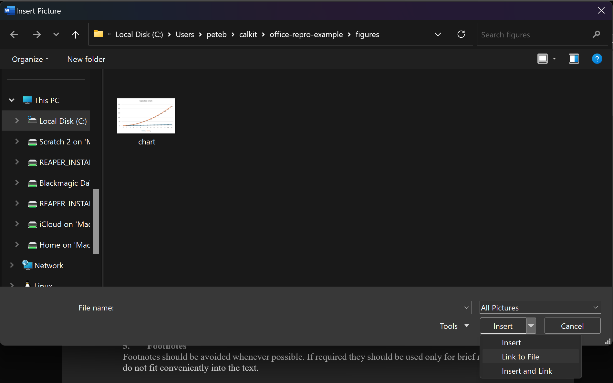
/// caption
Linking to the image file when inserting a picture in Word.
///

Again when we refresh we'll see that `paper.docx` has uncommitted changes,
so let's commit them with a message like
"Add figure to paper".

Now let's complete our pipeline by adding a stage to convert our
Word document to PDF,
so that can be the main artifact we share with the outside world.
There's a stage template for that on the website,
so follow the stage generation steps we used to extract the figure, but
this time select the "Word document to PDF" template,
filling out the Word document file path, the output PDF path,
add `figures/chart.png` to the list of input dependencies,
and select "publication" as our artifact type.
Fill in the title and description of the publication as well.
Adding `figures/chart.png` to the input dependencies will cause our
PDF generation stage to be rerun if that or `paper.docx` changes.
Otherwise, it will not run, so running the pipeline can be as fast as possible.

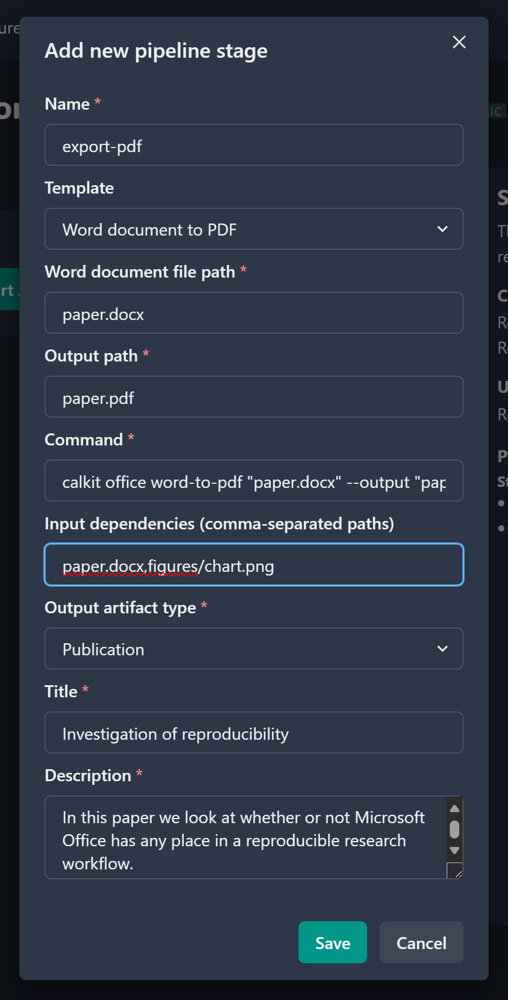{ width="450px" }
/// caption
Adding a stage to convert our Word document to PDF.
///

Again the pipeline will show that it's out-of-date,
so let's run and commit again, using a message like
"Export paper to PDF".
If we open up `paper.pdf` we can see that our figure is there
just like we expected.

But hold on a second you might say.
Why did we go through all this trouble just to create a PDF with
an Excel chart in it?
This would have been only a few steps to do manually!
That would be a valid point if this were a one-off project and nothing
about it would ever change.
However, for a research project, there will almost certainly be multiple
iterations (see again the PhD Comics cartoon above,)
and if we need to do each manual step each iteration,
it's going to get costly time-wise, and we could potentially forget
which steps need to be taken based on what files were changed.
We may end up submitting our paper with a chart that doesn't reflect
the most up-to-date data,
which would mean the chart in the paper could not be reproduced by a
reader.
Imagine if you had multiple datasets,
multiple steps of complex data analysis,
a dozen figures, and some slides to go along with your paper.
Keeping track of all that would consume valuable mental energy that could
be better spent on interpreting and communicating the results!

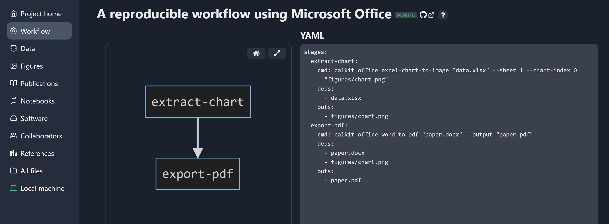
/// caption
A diagram and YAML representation of the pipeline on calkit.io.
///

To close the loop and show the value of using version control and a pipeline,
let's go and add a few rows to our dataset,
which will in turn change our chart in Excel.
If we save the file and look at the status,
we can see that this file is different,
and that our pipeline is again out-of-date,
meaning that our primary output (the PDF of the paper)
not longer reflects our input data.

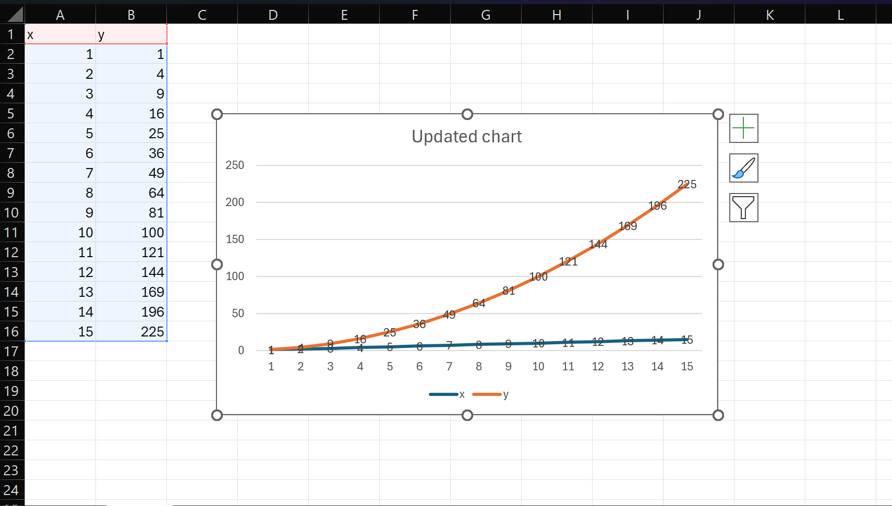
/// caption
Adding rows to the dataset.
///

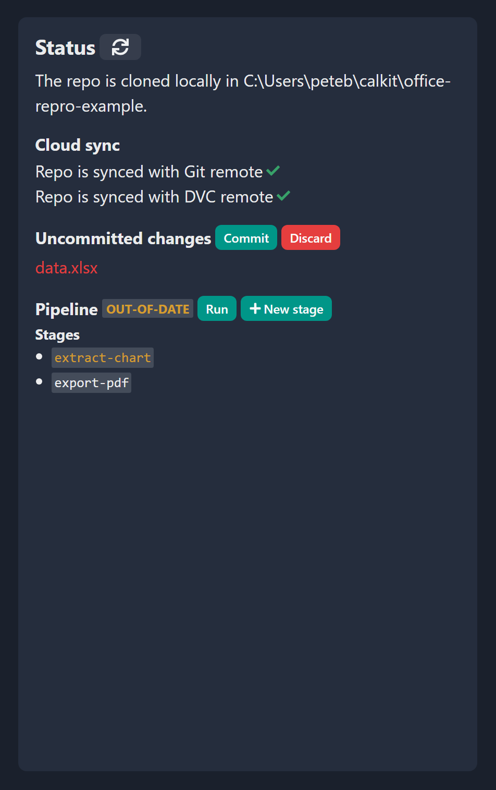{ width="450px" }
/// caption
After adding a row to the spreadsheet, the pipeline is again out-of-date.
///

Now with one click we can rerun the pipeline,
which is going to update both our figure PNG file and the paper PDF in one
shot.
We can then create a commit message explaining that we added to the dataset.
These messages can be audited later to see when and why something changed,
which can come in handy if all of a sudden things aren't looking right.
Having the files in version control also means we can go check out an old
version if we made a mistake.

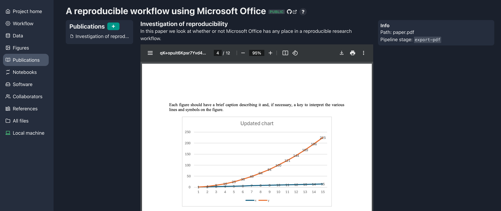
/// caption
Confirming the figure in our publication's PDF includes the additional rows.
///

Well, we did it.
We created a reproducible workflow using Microsoft Word and Excel,
and we didn't need to learn Git or DVC
or become a command line wizard.
Now we can iterate on our data, analysis, figures, and writing,
and all we need to do to get them all up-to-date and backed up is
to run the pipeline and commit any changes.
Now we can share our project and others can reproduce the outputs
(so long as they have a Microsoft Office license, but that's a topic
for another post.)
Everything is still in Git and DVC, so our more command line-oriented
colleagues can work in that way if they like using the same project repo.
To achieve this, all we had to do was follow the two most important rules:

1. All files go in version control.
2. Artifacts need to be generated by the pipeline.

If you'd like you can browse through this project up on
[calkit.io](https://calkit.io/petebachant/office-repro-example).
