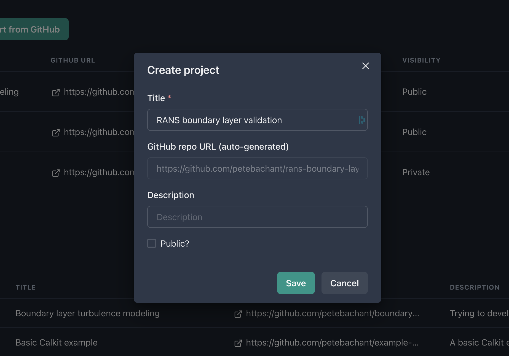
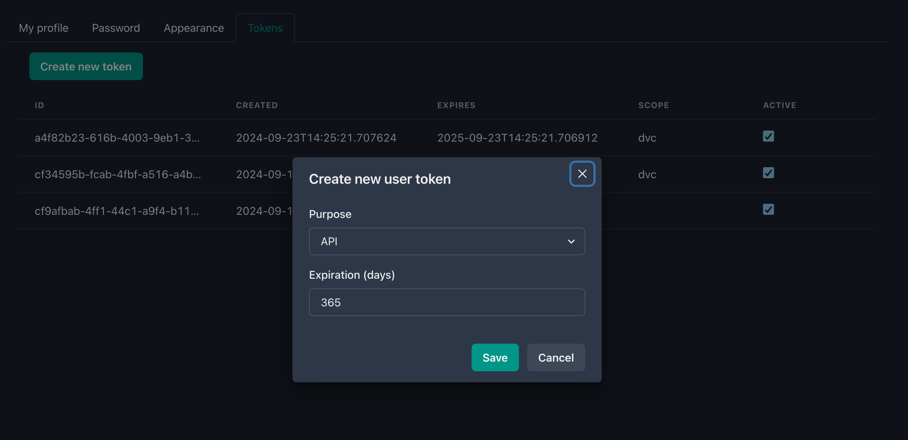
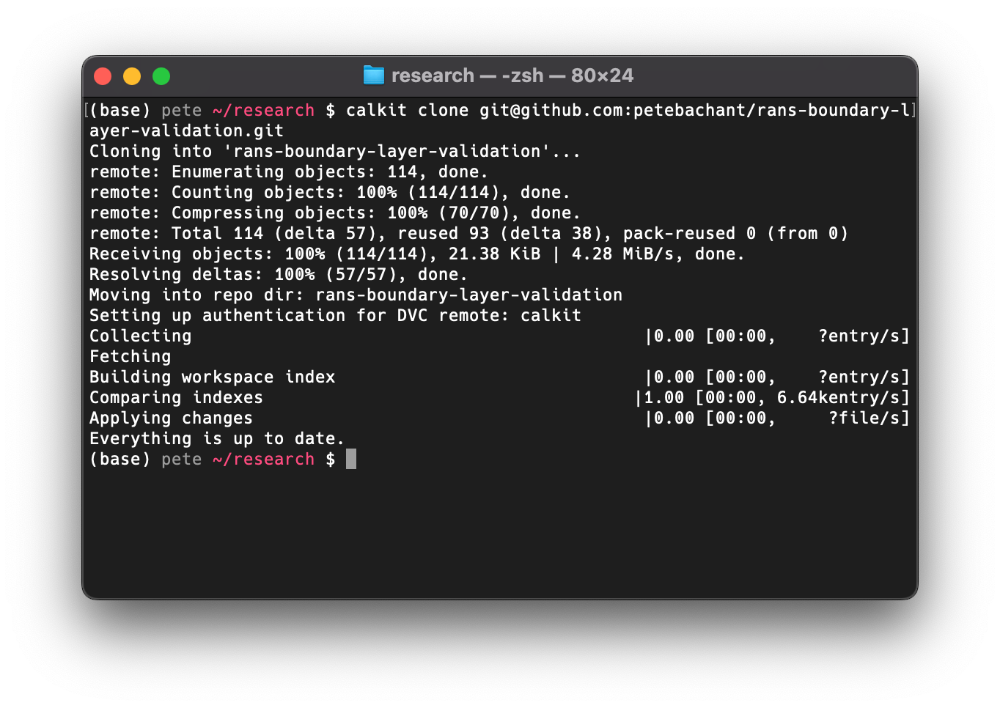
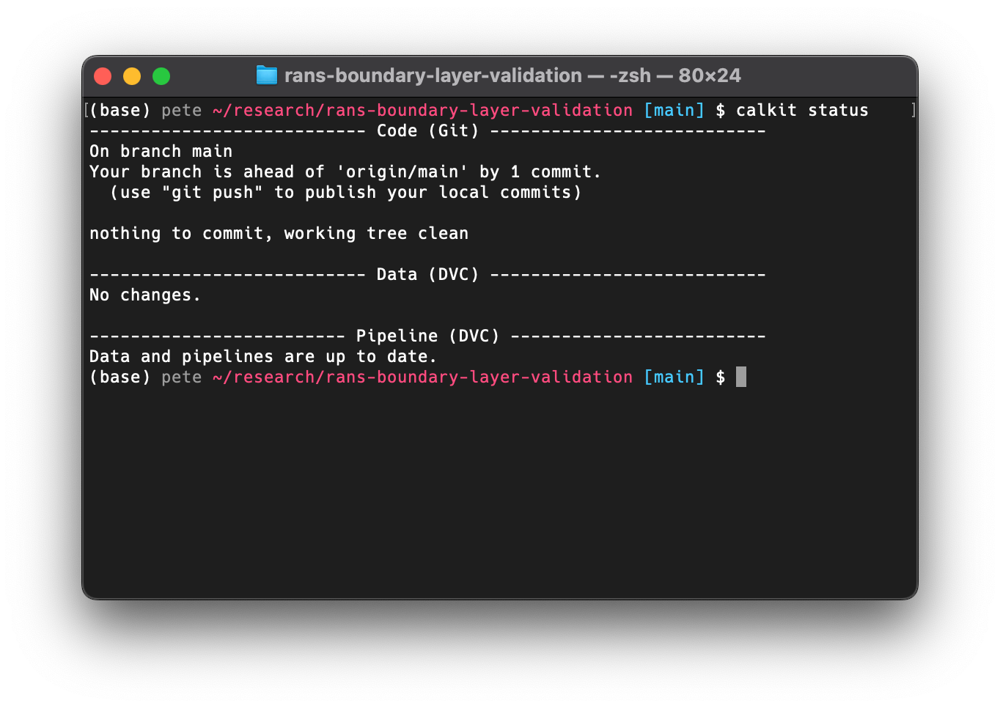
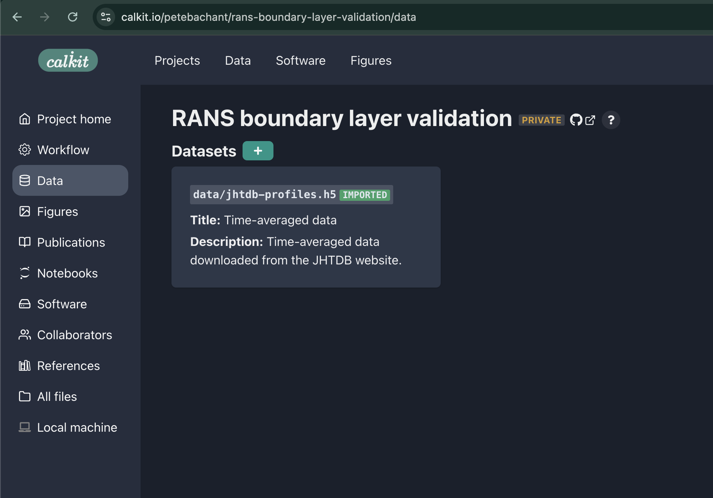
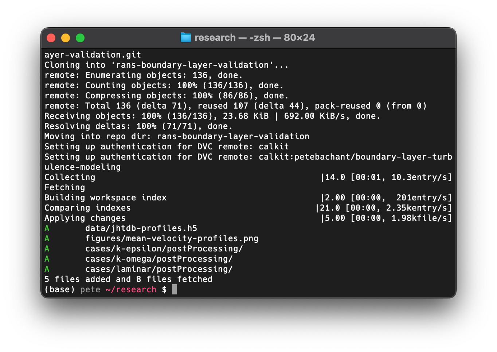
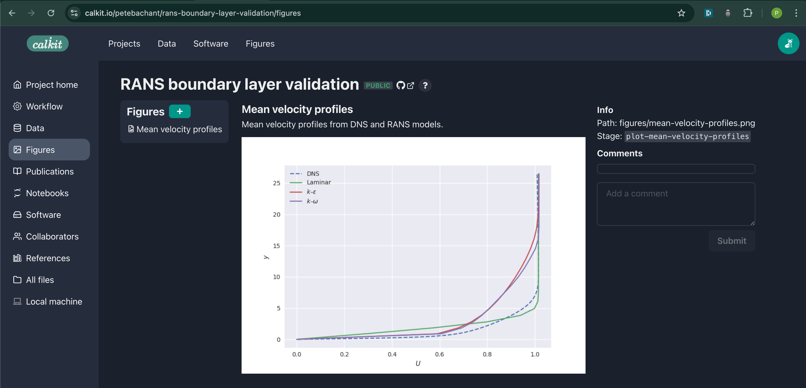

# OpenFOAM, Docker, and Reviewer 2

## The problem

Have you ever been here before?
You've done a bunch of work to get a simulation to run, created some figures,
and submitted a paper to a journal.
A month or two later you get the reviews back and you're asked by the dreaded
_Reviewer 2_ to make some minor modifications to a figure.
There's one small problem, however:
You don't remember how that figure was created,
or you've upgraded your laptop and now the script won't run.
Maybe you were able to clone the correct Git repo with the code,
but you don't remember where the data is supposed to be stored.
In other words, your project is not reproducible.

Here we'll show how to fix that.

## Creating and cloning the project repo

Head over to [calkit.io](https://calkit.io)
and log in with your GitHub account.
Click the button to create a new project.
Let's title ours "RANS boundary layer validation",
since for our example, we're going to create a project that attempts to
answer the question:

> What RANS model works best for a simple boundary layer?

We'll keep this private for now
(though in general it's good to work openly.)
Note that creating a project on Calkit also creates the project
Git repo on GitHub.



We're going to need a token to interact with the Calkit API,
so head over to your
[user settings](https://calkit.io/settings),
generate one for use with the API, and copy it to your clipboard.



Then we can set that token in our Calkit configuration with:

```sh
calkit config set token YOUR_TOKEN_HERE
```

Next, clone the repo to your local machine with (filling in your username):

```sh
calkit clone https://github.com/YOUR_USERNAME/rans-boundary-layer-validation.git
```

Note you can modify the URL above to use SSH if that's how you interact with
GitHub.



`calkit clone` is a simple wrapper around `git clone` that sets up the
necessary configuration to use the Calkit Cloud as a DVC remote,
the place where we're going to push our data,
while our code goes to GitHub.

## Getting some validation data

We want to validate these RANS models, so we'll need some data for comparison.
It just so happens that there is already a boundary layer
direct numerical simulation (DNS) dataset on
Calkit downloaded from the
[Johns Hopkins Turbulence Databases (JHTDB)](https://turbulence.pha.jhu.edu/),
so we can simply import that with (after `cd`ing into the project directory):

```sh
calkit import dataset \
    petebachant/boundary-layer-turbulence-modeling/data/jhtdb-transitional-bl/time-ave-profiles.h5 \
    data/jhtdb-profiles.h5
```

If we run `calkit status` we can see that there is one commit that has been
made but not pushed to `origin/main` (on GitHub), so we can
make sure everything is backed up there with `calkit push`.



`calkit status` and `calkit push` behave very similarly to `git status`
and `git push`. In fact, those commands are run alongside some additional
DVC commands, the importance of which we will see shortly.

We can now see our imported dataset as part of the project datasets on the
Calkit website.
We can also see the file is present, but ignored by Git,
since it's managed by DVC.
Because the dataset was imported, it does not take up any of this project's
storage space, but will be present when the repo is cloned.



## Creating a reproducible OpenFOAM environment with Docker

If you've never worked with Docker,
it can sound a bit daunting,
but Calkit has some tooling to make it a bit easier.
Basically, Docker is going to let us create isolated reproducible
environments in which to run commands and will keep track of
which environments belong to this project in the `calkit.yaml` file.

Let's create an OpenFOAM-based Docker environment with:

```sh
calkit new docker-env \
    --name foam \
    --image openfoam-2406-foampy \
    --from microfluidica/openfoam:2406 \
    --add-layer miniforge \
    --add-layer foampy \
    --description "OpenFOAM v2406 with foamPy."
```

This command will create the necessary Dockerfile and
add the environment to our project metadata.
The environment will be automatically created or updated
as necessary when a command is executed in this environment.

If we run `calkit xenv -- blockMesh -help`,
the Docker image build be built and we'll see the help output from
`blockMesh`.
Running this command again will not kick off a rebuild
unless the Dockerfile is modified.

You'll notice there is a new `Dockerfile-lock.json` file
in the repo,
which is how Calkit determines if the image needs to be rebuilt.
We should now
commit and push this file to the cloud so it is backed up and accessible to our
collaborators.
We can do this with the `calkit save` command:

```sh
calkit save Dockerfile-lock.json -m "Add Docker lock file"
```

which does the `add`, `commit`, `push` steps all in one,
deciding which files to store in DVC versus Git, and pushing to the respective
locations to save time and cognitive overhead.
However, if desired, you can of course run those individually for full control.

Now we're good to go.
We didn't need to install OpenFOAM, and neither will our
collaborators.
We're now ready to start setting up the cases.

## Adding the simulation runs to the pipeline

We can run things interactively and make sure things work,
but it's not a good idea to rely on interactive or ad hoc processes
to produce a permanent artifact.
Any time you get to a point where you do want to save something permanent,
the pipeline should be updated to produce that artifact,
so let's add some simulation runs to ours.

We want to run the simulation to validate a few different turbulence models:

- Laminar (no turbulence model)
- $k$–$\epsilon$
- $k$–$\omega$

I've setup this project to use [foamPy](https://github.com/petebachant/foamPy)
to create and run variants of a case with a "templatized"
`turbulenceProperties` file via a script `run.py`,
which we're going to run in our Docker environment.

To simulate the same case for multiple turbulence models,
we're going to create a "foreach" DVC stage to run our
script over a sequence of values.
When setup properly, DVC will be smart enough to cache the results
and not rerun simulations when they don't need to be rerun.
We can create this stage with:

```sh
calkit new foreach-stage \
    --cmd "calkit xenv python run.py --turbulence-model {var} -f" \
    --name run-sim \
    --dep system \
    --dep constant/transportProperties \
    --dep run.py \
    --dep Dockerfile \
    --out "cases/{var}/postProcessing" \
    "laminar" "k-epsilon" "k-omega"
```

Another call to `calkit status` shows our pipeline needs to be run,
which makes sense, so let's give it another `calkit run`.
You'll note at the very start our Docker image build stage is not rerun
thanks to DVC tracking and caching the inputs and outputs.

The output of `calkit status` now shows something we haven't seen yet:
we have some new data produced as part of those simulation runs.
We can do another `calkit save` to ensure everything is committed and
pushed:

```sh
calkit save -am "Run simulations"
```

In this case, the outputs of the simulations were pushed up to the DVC remote
in the Calkit Cloud.

We are defining an output for each simulation as the `postProcessing` folder,
which we will cache and push to the cloud for backup,
so others (including our future self),
can pull down the results and work with them without needing to rerun
the simulations.
We are also defining dependencies for the simulations.
What this means is that if anything in the `system` folder, the `run.py`
script, `constant/transportProperties`, or our Dockerfile changes,
DVC will know it needs to rerun the simulations.
Conversely, if those haven't changed and we already have results cached,
there's no need to rerun.
This is nice because to produce our outputs we basically
only need to remember one command and keep running it,
and that's simply `calkit run`,
which is a wrapper around `dvc repro` that parses some additional
metadata to define certain special objects, e.g., datasets or figures.

## Creating a figure to visualize our results

We want to compare the OpenFOAM results to the DNS data,
for which we can plot the mean streamwise velocity profiles, for example.
We can create a new figure with its own pipeline stage with:

```sh
calkit new figure \
    figures/mean-velocity-profiles.png \
    --title "Mean velocity profiles" \
    --description "Mean velocity profiles from DNS and RANS models." \
    --stage plot-mean-velocity-profiles \
    --cmd "calkit xenv python scripts/plot-mean-velocity-profiles.py" \
    --dep scripts/plot-mean-velocity-profiles.py \
    --dep data/jhtdb-profiles.h5 \
    --deps-from-stage-outs run-sim
```

The last line there is going to automatically create dependencies based on
the outputs of our `run-sim` stage,
saving us the trouble of typing out all of those directories manually.

Another call to `calkit status` shows we need to run the pipeline again,
and another call to `calkit run` then
`calkit save -m "Run pipeline to create figure"`
will create this figure and push it to the repo.
This figure is now viewable as its own object up on the website:


## Solving the problem

Now let's show the value of making our project reproducible,
addressing the problem we laid out in the introduction, assuming Reviewer 2's
request was something like:

> The legend labels should be updated to use mathematical symbols.

We're going to pretend we were forced to start from scratch,
so let's delete the local copy of our project repo
and clone it again using same `calkit clone` command we ran above.



After moving into the freshly cloned repo,
you'll notice our imported dataset,
the `cases/*/postProcessing` directories,
and our figure PNG file were all downloaded,
which would not have happened with a simple `git clone`,
since those files are kept out of Git.

Running `calkit status` and `calkit run` again shows that what we've
cloned is fully up-to-date.

Next we edit our plotting script to make the relevant changes.
Then we execute `calkit run`.
Again, notice how the simulations were not rerun thanks to the DVC cache.

If we run `calkit status` we see there are some differences,
so we run `calkit save -am "Change x-axis label for reviewer 2"`
to get those saved and backed up.
If we go visit the project on the Calkit website, we see our figure is
up-to-date and has the requested changes in the legend.
Reviewer 2 will be so happy 😀



## Conclusions and next steps

We created a project that runs OpenFOAM simulations reproducibly,
produces a figure comparing against an imported dataset,
and ensures these are kept in version control
and backed up to the cloud.
This is of course a simplified example for demonstration,
but you could imagine expanding the pipeline
to include more operations, such as:

- Running a mesh independence study.
- Building a LaTeX document as a report or paper.

Since DVC pipelines can run any arbitrary command,
you're not locked into a specific language or framework.
You could run shell scripts, MATLAB programs, etc.,
all in a single pipeline.

See this project up on
[Calkit](https://calkit.io/petebachant/rans-boundary-layer-validation)
and [GitHub](https://github.com/petebachant/rans-boundary-layer-validation).
