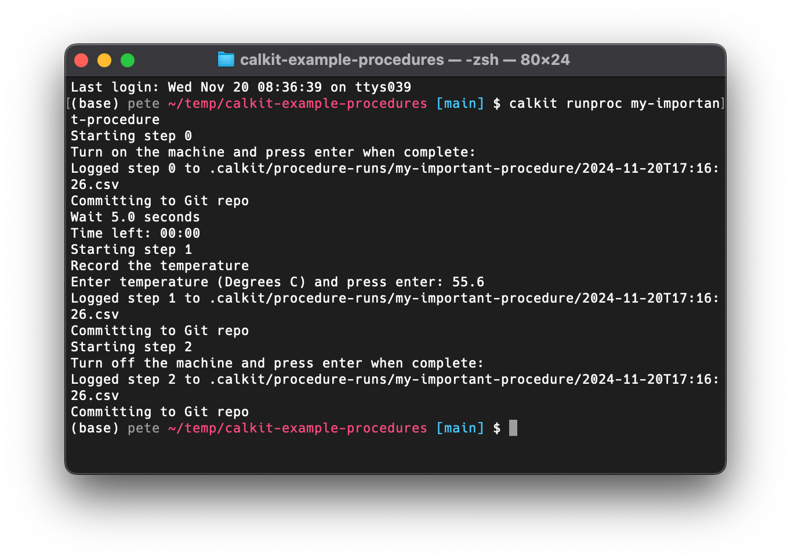

# Defining and executing procedures

Not everything can be automated... yet.
Sometimes we need to perform manual procedures as part of a research
protocol, e.g.,
to collect data during an experiment,
or simply to get the equipment ready.
These procedures can be potentially complex,
and in order to be reproducible,
they should be thoroughly documented and tracked as they're being
carried out.

To help make this easier,
we can define and execute procedures with Calkit.
This will allow you to define it ahead of time and not need to waste
time, e.g., during an experiment, figuring out what step you're on.

## Defining

The `Procedure` model in `calkit.models` shows the structure of a procedure.
Procedures are defined in the `procedures` section of `calkit.yaml`,
keyed by name.
For example, we might define a procedure with 3 steps like:

```yaml
procedures:
  my-important-procedure:
    title: My important procedure
    description: This is a manual procedure for setting up the experiment.
    steps:
      - summary: Turn on the machine
        wait_after_s: 5
      - summary: Record the temperature
        details: >
          In the upper right hand corner of the screen you will see a
          temperature value. Record this.
        inputs:
          temperature:
            units: Degrees C
            dtype: float
      - summary: Turn off the machine
        details: Press the power button.
```

### Keeping a procedure in its own file

A long procedure can crowd out the rest of `calkit.yaml`, so instead of
writing it inline, an entry can point at a YAML or JSON file that holds
it:

```yaml
procedures:
  my-important-procedure:
    path: procedures/my-important-procedure.yaml
```

The file contains exactly what would have gone inline, i.e., the `title`,
`description`, and `steps`:

```yaml
# procedures/my-important-procedure.yaml
title: My important procedure
description: This is a manual procedure for setting up the experiment.
steps:
  - summary: Turn on the machine
    wait_after_s: 5
  - summary: Turn off the machine
```

An entry is one or the other: `path` can't be combined with `title`,
`description`, or `steps`, so a procedure is defined in one place rather
than split between the two. Everything that reads procedures, e.g.,
`calkit xproc`, resolves the file, so the two forms behave the same.

## Executing

If we run `calkit xproc my-important-procedure` from the command line,
our procedure will start.
We will be prompted to perform the first step and press enter to confirm.

After confirming we've completed the first step,
Calkit is going to wait 5 seconds before asking us to perform the next
step, since we defined the `wait_after_s` attribute.
While we wait, we'll see a countdown timer, then once time is up,
we'll be prompted to complete the next step.

The second step (numbered as step 1, since we're zero-indexed)
defines an input called `temperature`.
The user will be prompted to enter a value, and in this case it will need to
be a valid `float`.



## Logging

As we run through the procedure, Calkit will be logging each step
and committing to the Git repo.
These logs will be saved as CSVs with paths like
`.calkit/procedure-runs/{procedure_name}/{start_date_time}.csv`.
The CSV file will have columns indicating what step number was performed,
when it was started, when it was finished, and will have a column
for each input defined, if applicable.

These logs can be read later for further analysis and/or visualization.

## Executing as part of the pipeline

Let's imagine we want to execute a procedure to collect some data
and then generate a plot of that data.
We can define this in our DVC pipeline so we know if/when the procedure
has been run, and if the plot need to be remade.

```yaml
stages:
  run-proc:
    cmd: calkit xproc my-important-procedure
    outs:
      - .calkit/procedure-runs/my-important-procedure:
          cache: false # Track this in Git, not DVC
          persist: true # Don't delete existing outputs
  plot-data:
    cmd: python scripts/plot-data.py
    deps:
      - .calkit/procedure-runs/my-important-procedure
    outs:
      - figures/my-plot.png
```

With this pipeline, when we execute `calkit run`,
if our procedure has never been executed, it will begin right then.
After completion, our `plot-data` stage will run.

If the procedure has been run once,
but we want to run it again, we can use the `-f` flag to force
it to be called, even though we already data present in
`.calkit/procedure-runs/my-important-procedure`.
After that, our `plot-data` stage will run since the procedure log folder
was defined as its input.
So again, with one command we can ensure all of our inputs and outputs are
consistent.
