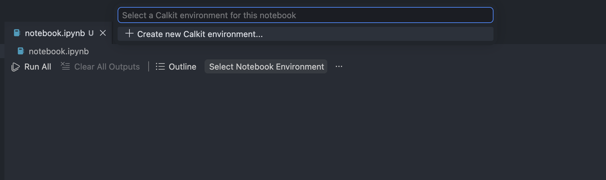
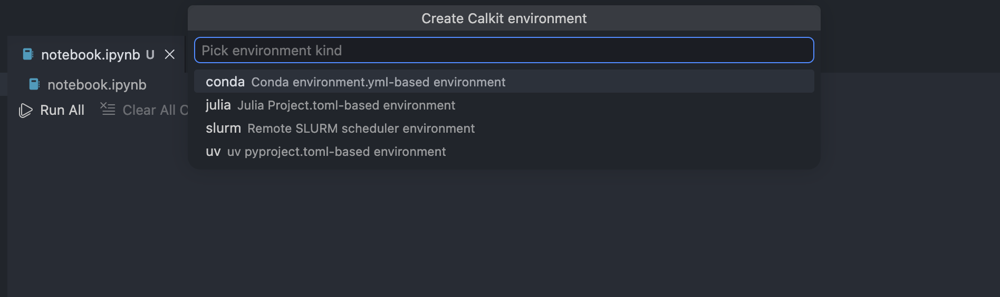
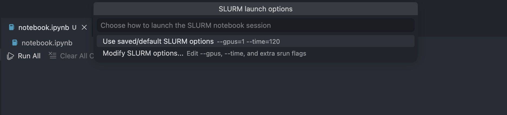
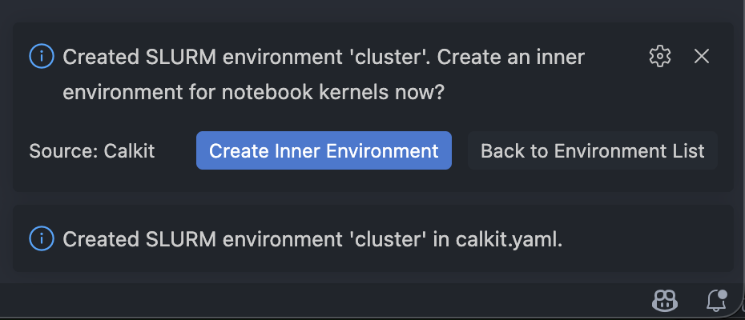
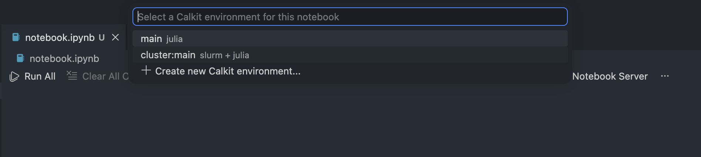
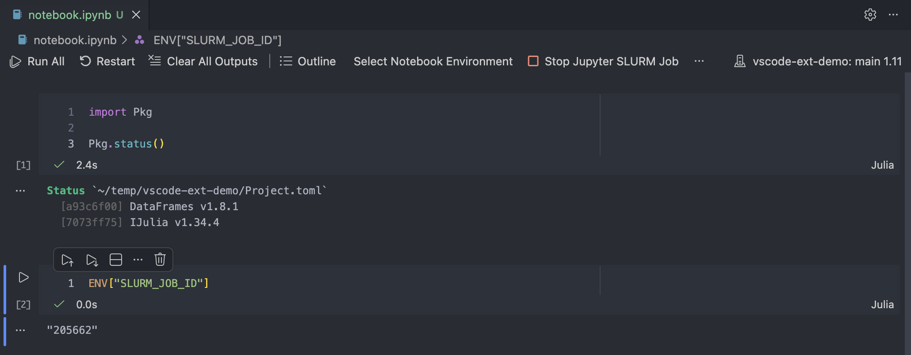

# Connect a Jupyter Notebook to a kernel in a SLURM environment in VS Code

In this tutorial we'll see how to connect a Jupyter Notebook open in VS Code
to a Jupyter kernel running in a SLURM environment.
One use case for such a feature is reserving a GPU node for your notebook.

First, connect to one of your cluster's login nodes
using the "Remote SSH: Connect to host..." command in VS Code
(press `ctrl/cmd+shift+p` to open the command pallette).

Next, install the
[Calkit VS Code extension](https://marketplace.visualstudio.com/items?itemName=Calkit.calkit-vscode)
by searching for "Calkit" in
the extension manager.

Next, create a notebook if you don't already have one.
One way to do this is to right click in the file explorer, select
"New File...", and create one with the `.ipynb` extension.
When opening, VS Code will see that it's a notebook.

With the notebook open, click "Select Notebook Environment" in the toolbar:

Let's first create a `slurm` environment for the cluster.
Going through the steps, you can give it a name,
define its host (this can be useful to ensure you don't run
a pipeline stage in the wrong place),
then some default options for any jobs to run in that environment:
`--gpus`, `--time`, and any others you'd like to use.
Note that you can change these later on and each time a Jupyter server
SLURM job is run.

After creation, you'll see a popup asking if you want to create an inner
environment.
Here's we'll create a `julia` environment, but you can use `conda` or `uv`
as well.
Calkit will ensure IJulia exists in the environment
(`ipykernel` for Python environments),
installing if necessary.

The Jupyter SLURM job will then launch, the environment will be checked
against its spec (in Julia this is like running `Pkg.instantiate()`,
so you won't need to do that later.)

You will then be able to select a nested environment for the notebook.
In this case, we called the SLURM environment `cluster` and the Julia
environment `main`, so we select `cluster:main` to launch
a Jupyter SLURM job and connect the notebook to its kernel.

If everything works as it should, you will see the kernel selected for the
notebook with a name like `{project_name}: {env_name}`.
You can check the kernel is actually running in a SLURM job by printing the
`SLURM_JOB_ID` environmental variable:

The job will be cancelled as soon as the notebook is closed.
Alternatively, it can be cancelled with the "Stop Jupyter SLURM Job" button
in the notebook toolbar.

Next time you open the notebook,
you'll be prompted to start a SLURM job for the Jupyter server.
You can commit `calkit.yaml` and the `.calkit` folder to version control
to make these settings portable.
You can also add the notebook as a
[pipeline stage](../pipeline/index.md) with the same nested
environment to ensure it's run top-to-bottom if the notebook, its environment,
or any of the inputs are modified.
