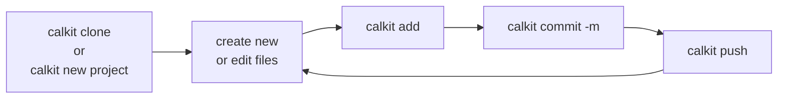
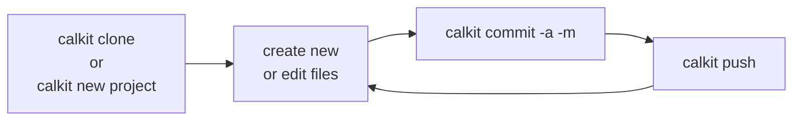
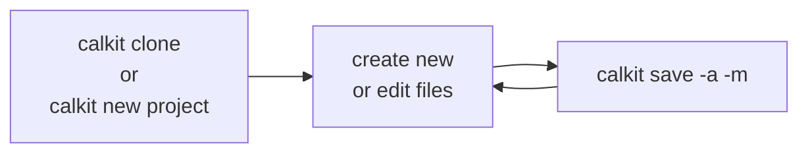

# Version control

Version control is one of the pillars of reproducibility.
However, the current de facto version control system (VCS),
[Git](https://git-scm.com),
was designed primarily for complex software development projects,
which provides lots of control and flexibility,
but with a daunting learning curve.
Since most of the value of version control for research projects comes from
simply saving checkpoints of the project files so it's clear if they have
changed, or so they can be reverted if something is broken,
Calkit provides a simplified interface that focuses on just that.
Additionally,
since Git was not designed for large and/or binary files,
Calkit uses [DVC](https://dvc.org) to version these file types.

GitHub is currently the most popular location to back up
Git repositories, or repos, in the cloud, but like Git,
is primarily designed for software development.
Similar to how Calkit is a layer on top of Git,
The Calkit Cloud ([calkit.io](https://calkit.io))
integrates with GitHub to provide a more purpose-built
interface for research projects.
It also serves as a default DVC remote,
so users are not required to provision their own.

Though Calkit adds a simplified interface on top of Git and DVC,
the lower-level tools `git` and `dvc` can be used if desired, e.g.,
for more complex operations.
Thus, beginners can start with the Calkit interface and learn the
lower-level tools along the way as needed.

## Typical workflow

In order to start working on a project,
the project repository must exist on your local machine.
This can be achieved either by creating a new repo or
downloading, or "cloning," an existing one from the cloud.
After a repo exists on your local machine,
it is typical to repeat the cycle of
committing new or changed files with a message describing them,
and then pushing those commits to the cloud.
This can be achieved with three workflow variants that provide increasing
levels of automation alongside decreasing levels of control.

The `add` step can be skipped for files that have been previously committed
by adding the `-a` flag, i.e.,:

The `add`, `commit`, and `push` steps can be combined into one with
`calkit save`:

## Commands

### `calkit new project`

### `calkit clone`

`calkit clone` will download and create a local copy of the project,
setup the default Calkit DVC remote and pull any files versioned with DVC.
The multi-step equivalent would be:

- `git clone`
- `calkit config remote`
- `dvc pull`

### `calkit add`

`calkit add` will add a file to the repo staging area.
Calkit will determine based on its type and size if it should be tracked
with Git or DVC and act accordingly.

Options:

- `--to`, `-t`: Manually specify `git` or `dvc` as the tracking mechanism.
- `--commit-message`, `-m`: Create a commit after adding
  and use the provided message.
- `--push`: Push to the Git or DVC remote after committing.

### `calkit save`

`calkit save` will create a commit and push to the remotes in one step.
It will automatically any ignore any files it deems to be inappropriate to
save in version control.
This provides the most automated and hands of experience
but gives the least control.
