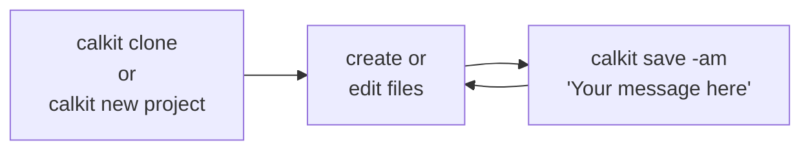
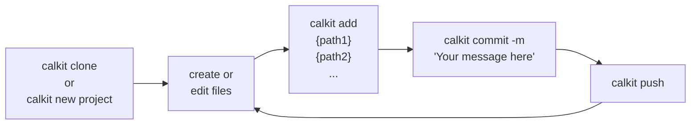
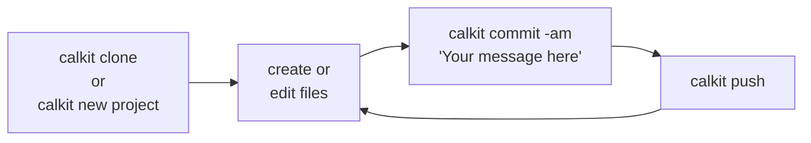

# Version control

Version control is one of the pillars of reproducibility.
However, the current de facto version control system (VCS),
[Git](https://git-scm.com),
was designed primarily for complex software development projects,
and thus provides lots of control and flexibility,
but with a daunting learning curve.

Since most of the value of using version control for research
projects comes from
simply saving checkpoints of the project files so it's clear if they have
changed, or so they can be reverted if something is broken,
Calkit provides a simplified interface that focuses on just that.
Additionally,
since Git was not designed for large and/or binary files,
Calkit uses [DVC](https://dvc.org) to version these file types.

[GitHub](https://github.com) is currently the most popular location to back up
Git repositories, or repos, in the cloud, but like Git,
is primarily designed for software development.
Similar to how Calkit is a layer on top of Git,
The Calkit Cloud ([calkit.io](https://calkit.io))
integrates with GitHub to add a more purpose-built
interface for research projects.
It also serves as a default DVC remote,
so users are not required to provision their own.

Though Calkit adds a simplified interface on top of Git and DVC,
the lower-level tools `git` and `dvc` can be used if desired, e.g.,
for more complex operations.

## Typical workflow

In order to start working on a project,
the project repository must exist on your local machine.
This can be achieved either by creating a new repo or
downloading, or "cloning," an existing one from the cloud.
After a repo exists on your local machine,
it is typical to repeat the cycle of
committing new or changed files with a message describing them,
and then pushing those commits to the cloud.
This can be achieved with three workflow variants that trade off
automation for control.

The simplest and most hands-off uses `calkit save`,
which will automatically make decisions about which files belong in Git
which belong in DVC, which don't belong in either,
commit them,
and push them to the cloud all with a single command:



The `-a` flag indicates that we want to save all relevant files
and the `-m` flag indicates that we are providing a message describing
the changes.
If omitted, Calkit will prompt the user for a message.

If more control is desired,
the `save` step can be broken down into `add`, `commit`
and `push` steps.



The `add` step can be skipped for files that have been previously committed
by adding the `-a` flag:



If you have a collaborator working on the same project,
any time they have pushed commits,
you will need to pull before being able to push yourself.

## Command reference

To view the help for any of these commands,
execute `calkit {command} --help`.

### `clone`

`calkit clone` will download and create a local copy of the project,
setup the default Calkit DVC remote and pull any files versioned with DVC.
The multi-step equivalent would be:

- `git clone`
- `calkit config remote`
- `dvc pull`

If the project is hosted on the Calkit Cloud, it can be referenced by
name rather than Git repo URL. For example:

```sh
calkit clone petebachant/strava-analysis
```

### `status`

`calkit status` will show the combined status from both Git and DVC.
For example:

```sh
$ calkit status
--------------------------- Code (Git) ---------------------------
On branch main
nothing to commit, working tree clean

--------------------------- Data (DVC) ---------------------------
No changes.

------------------------- Pipeline (DVC) -------------------------
Data and pipelines are up to date.
```

### `save`

`calkit save` will create a commit and push to the remotes in one step.
It will automatically any ignore any files it deems to be inappropriate to
save in version control.
This provides the most automated and hands of experience
but gives the least control.

Options:

- `[PATHS]...`: Specify a list of paths to save. Not required if `--all` is
  specified.
- `--all`, `-a`: Save all paths.
- `--to`, `-t`: Manually specify `git` or `dvc` as the tracking mechanism.
- `--message`, `-m`: Specify a commit message. If omitted, the user will be
  prompted for one.
- `--no-push`: Do not push after committing.

### `sync`

`calkit sync` will pull from then push to the cloud,
ensuring both copies are in sync.

### `add`

`calkit add` will add a file to the repo "staging area,"
which sets it up to be committed.
Calkit will determine based on its type and size if it should be tracked
with Git or DVC and act accordingly.

Options:

- `--to`, `-t`: Manually specify `git` or `dvc` as the tracking mechanism.
- `--commit-message`, `-m`: Create a commit after adding
  and use the provided message.
- `--auto-commit-message`, `-M`: Commit with an automatically-generated message.
  Only compatible when adding one path.
- `--push`: Push to the Git or DVC remote after committing.
