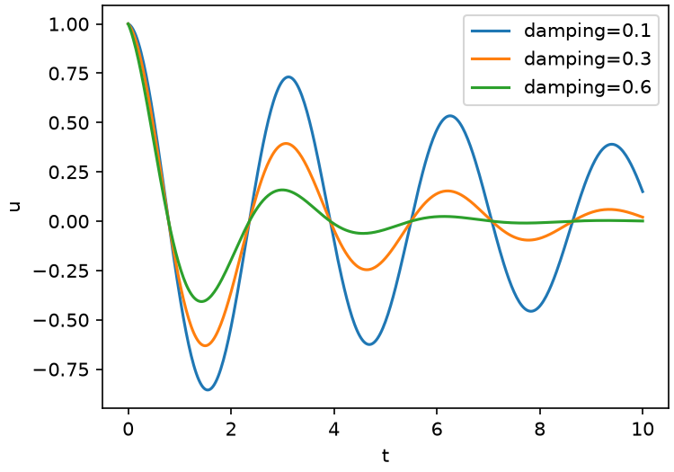

# wavetools

A tiny library of wave calculations---and an example of a package whose
README _is_ its pipeline.

Every code block below carrying a `calkit stage` annotation is a real
pipeline stage. The examples in this file are run, their output is written
back into it, and the figure it shows is the figure they produced. A
README that drifts from the code is a bug Calkit can catch.

## Installation

```sh calkit environment name=py
uv add wavetools
```

That is the line a reader runs to install the package. Read inside this
repository it means something more specific: `wavetools` is the package
_this_ project defines, so Calkit resolves it to the working tree rather
than to a release. The environment becomes this project's own
`pyproject.toml`, and every stage below depends on `src/wavetools` and
`uv.lock`---so editing the library reruns the examples that use it.

## Usage

`damped_wave` evaluates a damped cosine, and `rms` summarizes it:

```python calkit stage name=usage environment=py
import numpy as np

from wavetools import damped_wave, rms

t = np.linspace(0, 10, 401)
u = damped_wave(t, damping=0.3, frequency=2.0)

print(f"n samples: {t.size}")
print(f"rms: {rms(u):.4f}")
print(f"peak: {u.max():.4f}")
```

Standard output is written back into the block below on every run, so
what this README claims the code prints is what it actually printed:

```text calkit output stage=usage
n samples: 401
rms: 0.2933
peak: 1.0000
```

## Plotting

A stage can be narrated across several blocks: this one shares the name
`figure` with the block after it, and the two are joined, in order, into
one script.

```python calkit stage name=figure environment=py
import os

import matplotlib

matplotlib.use("Agg")
import matplotlib.pyplot as plt
import numpy as np

from wavetools import damped_wave

t = np.linspace(0, 10, 401)
```

Then draw a couple of damping ratios and save the result:

```python calkit stage name=figure outputs=[{path: figures/waves.png, storage: git}]
os.makedirs("figures", exist_ok=True)
fig, ax = plt.subplots(figsize=(5, 3.5), layout="constrained")
for damping in [0.1, 0.3, 0.6]:
    ax.plot(t, damped_wave(t, damping=damping), label=f"damping={damping}")
ax.set_xlabel("t")
ax.set_ylabel("u")
ax.legend()
fig.savefig("figures/waves.png", dpi=150)
print("wrote figures/waves.png")
```

```text calkit output stage=figure
wrote figures/waves.png
```

The figure is a tracked output stored in Git, so it renders wherever this
file is read---and it is never stale, because the stage that draws it
reruns whenever the library changes:



## Running it

```sh
calkit run
```

That block carries no annotation, so it is not a stage---just an
instruction for a reader. Only annotated blocks run.
