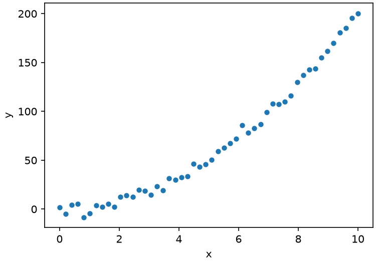
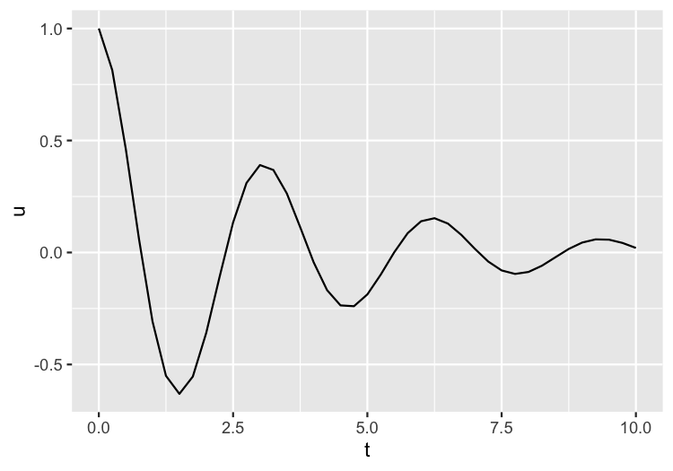

# Runnable README example

This project's pipeline lives in this file.
Every code block below that carries a `calkit stage` annotation is a real
pipeline stage: it runs in a real environment, its inputs and outputs are
tracked, and it is skipped when nothing it depends on has changed.

Run the whole thing with:

```sh
calkit run README.md
```

That block has no annotation, so it is not a stage---it is just an
instruction for a reader.
Only annotated blocks run.

## The environment

The stages below need these packages:

<!-- calkit environment name=py python=3.13 -->

- numpy
- matplotlib

That is an ordinary Markdown list, so it reads as documentation.
Calkit turns it into a `uv` environment named `py`, resolving and
locking it the same way it would one declared in `calkit.yaml`.

## Generating some data

A stage can be narrated across several code blocks.
These two share the name `analysis`, so they are joined, in order, into
one script.

First, build the data:

```python calkit stage name=analysis environment=py
import os

import numpy as np

os.makedirs("data", exist_ok=True)
rng = np.random.default_rng(seed=42)
x = np.linspace(0, 10, 50)
y = 2.0 * x**2 + rng.normal(scale=5.0, size=x.size)
```

Then fit it and write it out, still in the same stage:

```python calkit stage name=analysis outputs=[{path: data/data.csv, storage: git}]
coeffs = np.polyfit(x, y, deg=2)
print(f"fitted quadratic coefficient: {coeffs[0]:.3f}")
print(f"n points: {x.size}")

np.savetxt(
    "data/data.csv", np.column_stack([x, y]), delimiter=",", header="x,y"
)
```

Standard output from a run is written back into the block below, so what
the README claims the code prints is what it actually printed:

```text calkit output stage=analysis
fitted quadratic coefficient: 1.974
n points: 50
```

## Plotting

This is a separate stage. It declares `data/data.csv` as an input, so Calkit
knows it runs after `analysis`, and reruns it whenever the data changes:

```python calkit stage name=figure environment=py inputs=[data/data.csv] outputs=[{path: figures/figure.png, storage: git}]
import os

import matplotlib

matplotlib.use("Agg")
import matplotlib.pyplot as plt
import numpy as np

os.makedirs("figures", exist_ok=True)
data = np.loadtxt("data/data.csv", delimiter=",")
fig, ax = plt.subplots(figsize=(5, 3.5), layout="constrained")
ax.plot(data[:, 0], data[:, 1], "o", markersize=4)
ax.set_xlabel("x")
ax.set_ylabel("y")
fig.savefig("figures/figure.png", dpi=150)
```

The figure is an ordinary tracked output, so it is referenced the way any
image would be. It is declared with `storage: git` so it lives in the
repo and renders wherever this file is read:



## What the annotations look like

Calkit reads the part of a fence's info string after the language, which
Markdown renderers ignore.
A stage is declared like this:

````md
```python calkit stage name=example inputs=[in.csv] outputs=[out.png]
print("hello")
```
````

Attribute values are YAML, so an output needing more than a path is
written like `outputs=[{path: out.png, storage: git}]`.

When a declaration gets too long to sit comfortably on the fence, it can
go in an HTML comment just above the block instead, which is invisible
when the file is rendered.
The comment attaches to the block directly below it, so this declares one
stage, exactly as the version above does:

````md
<!-- calkit stage name=example environment=py
     inputs=[data/one.csv, data/two.csv, data/three.csv]
     outputs=[out.png] -->

```python
print("hello")
```
````

Note the fence carries no annotation there at all.
Attributes can also be spread across both places, in which case they are
simply combined; setting the same one twice is an error rather than one
quietly winning.

Note that the two blocks above are inside a longer fence, so they are
shown rather than run.

## Other languages

You can use Julia and R too.
Each language gets its own environment, declared exactly the same way.
Note that no `kind` is given below: Calkit works out that one is a Julia
environment and the other is `renv` from the language of the code blocks
that use them.

Our Julia dependencies are:

<!-- calkit environment name=jl julia=1.12 -->

- CSV
- DataFrames

This Julia stage writes a second dataset:

```julia calkit stage name=julia environment=jl outputs=[{path: data/data2.csv, storage: git}]
using CSV
using DataFrames

mkpath("data")
t = 0:0.25:10
df = DataFrame(t=t, u=@. exp(-0.3 * t) * cos(2 * t))
CSV.write("data/data2.csv", df)
println("wrote $(nrow(df)) rows")
```

```text calkit output stage=julia
wrote 41 rows
```

Our R dependencies are:

<!-- calkit environment name=r -->

- ggplot2

And this R stage plots it, taking the Julia stage's output as its input so
Calkit knows the order to run them in:

```r calkit stage name=r environment=r inputs=[data/data2.csv] outputs=[{path: figures/data2.png, storage: git}]
library(ggplot2)

dir.create("figures", showWarnings = FALSE)
df <- read.csv("data/data2.csv")
p <- ggplot(df, aes(x = t, y = u)) +
  geom_line() +
  labs(x = "t", y = "u")
ggsave("figures/data2.png", p, width = 5, height = 3.5, dpi = 150)
cat("plotted", nrow(df), "rows\n")
```

```text calkit output stage=r
plotted 41 rows
```


